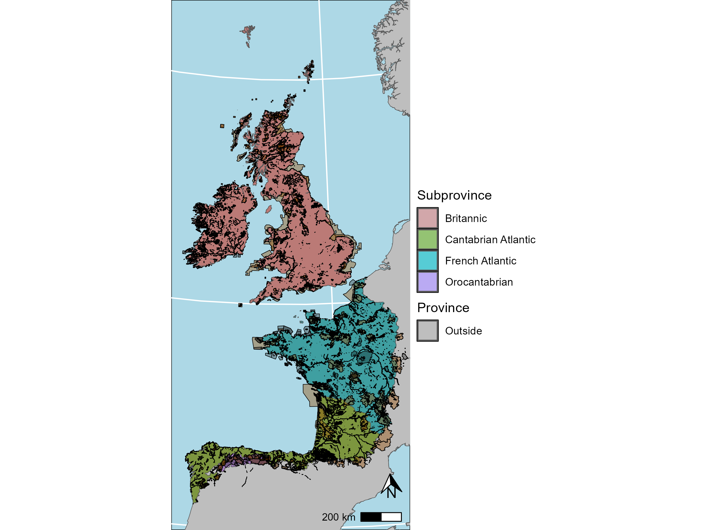

#*Introduction*

The European Atlantic Floristic region, characterized by high rainfall, oceanic climate, and floristic affinities, includes several subprovinces along the western edge of Europe. Although the limits of this floristic regions have long been disputed, the Celtic Fringe is recognized as its climatic and floristic core (Rivas-Martínez et al., 2017b; Buck & Hopkins, 1995; Roisin, 1969; Rivas-Martinez & Armaiz, 2014; European Environment Agency (EEA), 2003; Kozlowski et al., 2009). The Atlantic Ocean greatly influences its climate, which is characterized by mild temperatures with limited variation, high precipitations and low seasonality (European Environment Agency (EEA), 2003, 2017; Rivas-Martínez, Penas & Díaz, 2001; Buck & Hopkins, 1995; Fernández Prieto et al., 2020; Rivas-Martínez et al., 2017a). Celtic Fringe floristic province is formed by 4 subprovinces: the Cantabrian Atlantic subprovince, the Orocantabrian subprovince, the French Atlantic subprovince, and the Britannic subprovince (European Environment Agency (EEA), 2003; Rivas-Martínez, Penas & Díaz, 2001; Fernández Prieto et al., 2020; Buck & Hopkins, 1995; Roisin, 1969).
The subprovinces' boundaries have been contention, however, we have followed those set by Rivas-Martínez, Penas & Díaz (2004), (European Environment Agency (EEA), 2017) and Fernández Prieto et al. (2020) to create our Celtic Fringe target area, encompassing  transitional zones influenced by Mediterranean, Central European, and Alpino-Caucasian elements (Rivas-Martínez et al., 2017a; Rivas-Martinez & Armaiz, 2014; Fernández Prieto et al., 2020) and both insular and continental areas. Consequently, the target area of the Celtic Invasive Plants database is formed by 8341 10x10 km UTM grids comprising territories in Portugal, Spain, France, the United Kingdom, the Republic of Ireland, and Denmark (specifically the Faroe Islands).




#*CelticInvasivePlantsdb*

Using the list of invasive alien species of Union concern of the EU, the national checklists of these countries and species occurrences we generated the Celtic Invasive Plants database.This database is formed by 271 vascular plants (= Tracheophyta) Alien Invasive Species (AIS) and comprises 175769 occurrences, each enriched with taxonomic, floristic, and administrative metadata to enhance usability across multiple geographic and governance levels. This harmonized and standardized resource is designed to support AIS management strategies at local, national, and transnational scales, while facilitating conservation planning and advancing research on invasion dynamics.The CelticInvasivePlantsdb R package allows to explore and select the data from the Celtic Invasive Plants database.

During the process of building this database, we found two different types of taxa with respect to their native status within the Celtic Fringes:
* Native and Alien Invasive Species of the Celtic Fringe (NAIS): These taxa are native to some country or countries of the Celtic Fringe, but are catalogued as invasive in other area of the Celtic Fringe.
* Alien Invasive Species of the Celtic Fringe (AIS): These taxa are alien to the Celtic Fringe.

## Features of the Celtic Invasive Plants database

This database is structured in several different files storing taxonomic, administrative and biogeographic information about the taxa and occurrences:
 
* CIP_DB_APRIL_2025.csv: This is the main document of the database. Each entry corresponds to a species occurrence and with 10 x10 km UTM grid resolution.
*CIP_DB_APRIL_2025_CHECKLIST_&_VERIFICATION.csv: Species checklist with asociated information: WCVP valid names at various taxonomic levels, biogeografic information, offcially listed status and name and a list of found synonyms.
*CIP_DB_APRIL_2025_DATA_DESCRIPTION.csv: Description of the columns information and files in which they can be found.
*CIP_DB_APRIL_2025_NAIS_VERIFICATION.csv: Results of the NAIS validation process.
*CIP_DB_APRIL_2025_UNIQUE_VALUES.csv: List of unique values per column.
*unique_values{Country}.csv: List of unique values per column by country.
*CIP_DB_APRIL_2025_PROTECTED_AREAS.csv: Table detailing the features of each Protected Area included in the target area.
*CIP_DB_APRIL_2025_Grids_merges_ and_relocations.csv: Table detailing the grids merges and relocations.

All these files can be downloaded, modified, explored and graphically represented using the functions of the CelticInvasivePlantsdb R package. These are the columns that may be found in the different files: 

|Column_name|Variable_Type|Description|Entry_treatment|Values|Dataset|
|----------|-------------|-----------|---------------|------|-------|
|Taxa|Categorical|Accepted Name of the Taxon according to the World Checklist of Vascular Plants (WCVP) (Govaerts et al., 2021; The World Flora Online Consortium et al., 2023; Govaerts, 2023).|Several entry can have the same value.|Various (271x)|Celtic Invasive Plants database (CIP_DB_APRIL_2025.csv) & complete Celtic Invasive Plants checklist (CIP_DB_APRIL_2025_CHECKLIST_&_VERIFICATION.csv)|
|Phylum|Categorical|Major phylum of the Taxa according to the taxonomic backbone of the Angiosperm Phylogeny Group (APG) IV (The Angiosperm Phylogeny Group, 2016) |Same value for all entries with the same ‘Taxa’ value.|‘Spermatophyta’ OR ‘Pteridophyta’|Celtic Invasive Plants database (CIP_DB_APRIL_2025.csv) & complete Celtic Invasive Plants checklist (CIP_DB_APRIL_2025_CHECKLIST_&_VERIFICATION.csv)|
|Subphylum|Categorical|Subphylum of the Taxa according to the taxonomic backbone of the Angiosperm Phylogeny Group (APG) IV (The Angiosperm Phylogeny Group, 2016)|Same value for all entries with the same ‘Taxa’ value.|‘Angiosperms’ OR ‘Monilophyta’ OR ‘Gymnosperms’|Celtic Invasive Plants database (CIP_DB_APRIL_2025.csv) & complete Celtic Invasive Plants checklist (CIP_DB_APRIL_2025_CHECKLIST_&_VERIFICATION.csv)|
|Order|Categorical|Order of the Taxa according to the taxonomic backbone of the Angiosperm Phylogeny Group (APG) IV (The Angiosperm Phylogeny Group, 2016) |Same value for all entries with the same ‘Taxa’ value.|Various (39x)|Celtic Invasive Plants database (CIP_DB_APRIL_2025.csv) & complete Celtic Invasive Plants checklist (CIP_DB_APRIL_2025_CHECKLIST_&_VERIFICATION.csv)|
|Family|Categorical|Valid family according to the Plants of the World Online (POWO) backbone (Royal Botanic Gardens Kew, 2025) |Same value for all entries with the same ‘Taxa’ value.|Various (79x)|Celtic Invasive Plants database (CIP_DB_APRIL_2025.csv) & complete Celtic Invasive Plants checklist (CIP_DB_APRIL_2025_CHECKLIST_&_VERIFICATION.csv)|
|Genus|Categorical|Valid genus according to the World Checklist of Vascular Plants (WCVP) (Govaerts et al., 2021; The World Flora Online Consortium et al., 2023; Govaerts, 2023)|Same value for all entries with the same ‘Taxa’ value.|Various (162x)|Celtic Invasive Plants database (CIP_DB_APRIL_2025.csv) & complete Celtic Invasive Plants checklist (CIP_DB_APRIL_2025_CHECKLIST_&_VERIFICATION.csv)|
|Species_with_Author|Categorical|Valid author abbreviation according to the World Checklist of Vascular Plants (WCVP) (Govaerts et al., 2021; The World Flora Online Consortium et al., 2023; Govaerts, 2023)|Same value for all entries with the same ‘Taxa’ value.|Various (271x)|Celtic Invasive Plants database (CIP_DB_APRIL_2025.csv) & complete Celtic Invasive Plants checklist (CIP_DB_APRIL_2025_CHECKLIST_&_VERIFICATION.csv)|
|Taxa_ID|Categorical|Taxon the Plants of the World Online (POWO) ID (Royal Botanic Gardens Kew, 2025)|Same value for all entries with the same ‘Taxa’ value.|Various (271x)|Celtic Invasive Plants database (CIP_DB_APRIL_2025.csv) & complete Celtic Invasive Plants checklist (CIP_DB_APRIL_2025_CHECKLIST_&_VERIFICATION.csv)|
|Taxa_URL|Categorical|Plants of the World Online (POWO) (Royal Botanic Gardens Kew, 2025) URL|Same value for all entries with the same ‘Taxa’ value.|Various (271x)|Celtic Invasive Plants database (CIP_DB_APRIL_2025.csv) & complete Celtic Invasive Plants checklist (CIP_DB_APRIL_2025_CHECKLIST_&_VERIFICATION.csv)|
|Celtic_Fringe_Taxa_Category|Binary|Status of the specific taxon occurring in a certain UTM 10x10 Km grid. Taxa can be Native and Alien Invasive Species of the Celtic Fringe (NAIS).if they are native to certain subprovinces and countries of the Celtic Fringe of the European Atlantic Floristic Region and listed as AIS in other(s) or Alien Invasive Species of the Celtic Fringe (AIS) if they are listed as AIS in at list one of the countries (see CIP_DB_APRIL_2025_CHECKLIST_&_VERIFICATION.csv & CIP_DB_APRIL_2025_NAIS_VERIFICATION.csv)|Same value for all entries with the same ‘Taxa’ value.|‘AIS’ OR ‘NAIS’|Celtic Invasive Plants database (CIP_DB_APRIL_2025.csv) & complete Celtic Invasive Plants checklist (CIP_DB_APRIL_2025_CHECKLIST_&_VERIFICATION.csv)|
|Officially_listed|Binary|Whether the taxon is listed within Invasive Species Oficial Checklist of the country where the UTM 10x10 Km grid is located |Same value for all entries with the same combination of ‘Taxa’ value and ‘Country’ value|‘YES’ OR ‘NO’|Celtic Invasive Plants database (CIP_DB_APRIL_2025.csv)|
|EU_Concern|Binary|Whether the taxa is listed within the AIS Union Concern checklist (European Commission, 2016, 2017, 2019, 2022, 2025)|Same value for all entries with the same ‘Taxa’ value.|‘YES’ OR ‘NO’|Celtic Invasive Plants database (CIP_DB_APRIL_2025.csv) & complete Celtic Invasive Plants checklist (CIP_DB_APRIL_2025_CHECKLIST_&_VERIFICATION.csv)|
|Celtic_Fringe_Origin|Binary|Whether the taxon is native of alien to the Celtic Fringe of the European Atlantic Floristic Region (see CIP_DB_APRIL_2025_CHECKLIST_&_VERIFICATION.csv & CIP_DB_APRIL_2025_NAIS_VERIFICATION.csv) |Same value for all entries with the same ‘Taxa’ value.|‘Alien’ OR ‘Native’|Celtic Invasive Plants database (CIP_DB_APRIL_2025.csv) & complete Celtic Invasive Plants checklist (CIP_DB_APRIL_2025_CHECKLIST_&_VERIFICATION.csv)|
|Local_Origin|Binary|Whether the taxon is native of alien to the country in which the occurrence is located (see CIP_DB_APRIL_2025_CHECKLIST_&_VERIFICATION.csv & CIP_DB_APRIL_2025_NAIS_VERIFICATION.csv) (Native/Alien)|Same value for all entries with the same combination of ‘Taxa’ value and ‘Country’ value|‘Alien’ OR ‘Native’ OR ‘Extinct’|Celtic Invasive Plants database (CIP_DB_APRIL_2025.csv)|
|Subprovince|Categorical|Subprovince of the Celtic Fringe of the European Atlantic Floristic Region acoording to the boundaries of Rivas-Martínez, Penas & Díaz (2004), Fernández Prieto et al. (2020) and Instituto Geográfico Nacional (2024) to which the centroid of UTM 10x10 Km grid belongs |Same value for all entries with the same ‘UTM_grid’ value.|‘Cantabrian Atlantic’ OR ‘Orocantabrian’ OR ‘French Atlantic’ OR ‘Britannic’ |Celtic Invasive Plants database (CIP_DB_APRIL_2025.csv)|
|UTM_grid|Categorical|UTM 10x10 Km grid name|Several entry can have the same value.|Various (7843x)|Celtic Invasive Plants database (CIP_DB_APRIL_2025.csv)|
|Latitude|Numeric|Decimal coordinates of the centroid of the UTM 10x10 Km grid|Same value for all entries with the same ‘UTM_grid’ value.|Various (3998x)|Celtic Invasive Plants database (CIP_DB_APRIL_2025.csv)|
|Longitude|Numeric|Decimal coordinates of the centroid of the UTM 10x10 Km grid|Same value for all entries with the same ‘UTM_grid’ value.|Various (7638x)|Celtic Invasive Plants database (CIP_DB_APRIL_2025.csv)|
|Country|Categorical|Country to which the centroid decimal coordinates of the UTM 10x10 Km grid belongs |Same value for all entries with the same ‘UTM_grid’ value.|'France' OR 'Portugal' OR 'Spain / España' OR 'United Kingdom' OR 'Ireland / Éire' OR 'Denmark / Danmark / Danmørk'|Celtic Invasive Plants database (CIP_DB_APRIL_2025.csv)|
|Constituent_Country_OR_Crown_Dependency|Categorical|Only applicable to Denmark (Faroe Island) and the United Kingdom |Same value for all entries with the same ‘UTM_grid’ value.|“England” OR‘Wales / Cymru’ OR ‘Scotland / Alba’, Jersey / Jèrri’ OR ‘Bailiwick of Guernsey / Bailliage dé Guernési’ OR ‘Northern Ireland / Tuaisceart Éireann’ OR ‘Isle of Man / Ellan Vannin’ OR ‘Faroe Islands / Føroyar’ |Celtic Invasive Plants database (CIP_DB_APRIL_2025.csv)|
|Admin_units_II|Categorical|This corresponds to the the largest administrative units beneath country or self-governing territory. Porugal: Distrito, Spain: Comunidad Autónoma, France: Régions, UK: England Combined Authorities & England Combined County Authorities & England Councils & Scotland Council Areas & Wales Principal Areas & Northern Ireland Districts, Ireland: Provinces of Ireland (Cúigí na hÉireann) and Faroe Islands: Sýsla.|Same value for all entries with the same ‘UTM_grid’ value.|Various (176x)|Celtic Invasive Plants database (CIP_DB_APRIL_2025.csv)|
|Admin_units_III|Categorical|Second largest administrative unit beneath country or self-governing territory where applicable Portugal: Districto, Spain: Provincia, France: Département, Ireland: County of Ireland, UK: Counties of England and Faroe Islands: Kommuna).|Same value for all entries with the same ‘UTM_grid’ value.|Various (235x)|Celtic Invasive Plants database (CIP_DB_APRIL_2025.csv)|
|Presence_Protected_Area|Binary|Presence of any nature protected area either nationally designated (European Environment Agency (EEA), 2024; 2025a) or belonging to the Natura 2000 network(European Environment Agency (EEA), 2025b).|Same value for all entries with the same ‘UTM_grid’ value.|‘1’ (=present) OR ‘0’ (=not present)|Celtic Invasive Plants database (CIP_DB_APRIL_2025.csv)|
|Presence_Natura_2000|Binary|Presence of a protected area belonging to the Natura 2000 network (European Environment Agency (EEA), 2025b)|Same value for all entries with the same ‘UTM_grid’ value. Only appliable to entry with a value of ‘1’ in the ‘Presence_Protected_Area’ column.|‘1’ (=present) OR ‘0’ (=not present)|Celtic Invasive Plants database (CIP_DB_APRIL_2025.csv)|
|Presence_National_Nature_Reserve|Binary|Presence of nationally designated protected area (European Environment Agency (EEA), 2024; 2025a)|Same value for all entries with the same ‘UTM_grid’ value. Only appliable to entry with a value of ‘1’ in the ‘Presence_Protected_Area’ column.|‘1’ (=present) OR ‘0’ (=not present)|Celtic Invasive Plants database (CIP_DB_APRIL_2025.csv)|
|National_Nature_Reserve_Name|Categorical|Official name of a nationally designated protected area (European Environment Agency (EEA), 2024; 2025a) according to the World Database of Protected Area (WDPA) (https://www.protectedplanet.net/en)|Same value for all entries with the same ‘UTM_grid’ value. Only appliable to entry with a value of ‘1’ in the ‘Presence_Protected_Area’ column.|Various (1704x)|Celtic Invasive Plants database (CIP_DB_APRIL_2025.csv)|
|Natura_2000_Name|Categorical|Official name of a Natura 2000 protected area (European Environment Agency (EEA), 2025b) according to the World Database of Protected Area (WDPA) (https://www.protectedplanet.net/en) |Same value for all entries with the same ‘UTM_grid’ value. Only appliable to entry with a value of ‘1’ in the ‘Presence_Protected_Area’ column.|Various (1097x)|Celtic Invasive Plants database (CIP_DB_APRIL_2025.csv)|
|Special_Areas_of_Conservation_(Habitats_Directive)|Binary|Only applicable to protected ares beloging to the Natura 2000 Network. This columns specifies whether the protected area is classifed as Special Areas of Conservation of the EU Habitats Directive (European Union, 1992) according to the World Database of Protected Area (WDPA) (https://www.protectedplanet.net/en)|Same value for all entries with the same ‘Natura_2000_Name’ value. Only appliable to entry with a value of ‘1’ in the ‘Presence_Natura_2000 column.|‘YES’ OR ‘NO’|Celtic Invasive Plants database (CIP_DB_APRIL_2025.csv)|
|Special_Protection_Area_(Birds_Directive)|Binary|Only applicable to protected ares beloging to the Natura 2000 Network. This columns specifies whether the protected area is classifed as Special Protection Area in the EU Birds Directive (European Union, 2009) according to the World Database of Protected Area (WDPA) (https://www.protectedplanet.net/en)|Same value for all entries with the same ‘Natura_2000_Name’ value. Only appliable to entry with a value of ‘1’ in the ‘Presence_Natura_2000 column.|‘YES’ OR ‘NO’|Celtic Invasive Plants database (CIP_DB_APRIL_2025.csv)|
|Site_of_Community_Importance_(Habitats_Directive)|Binary|Only applicable to protected ares beloging to the Natura 2000 Network. This columns specifies whether the protected area is classifed as Site of Community Importance of the EU Habitats Directive (European Union, 1992) according to the World Database of Protected Area (WDPA) (https://www.protectedplanet.net/en)|Same value for all entries with the same ‘Natura_2000_Name’ value. Only appliable to entry with a value of ‘1’ in the ‘Presence_Natura_2000 column.|‘YES’ OR ‘NO’|Celtic Invasive Plants database (CIP_DB_APRIL_2025.csv)|
|National_Designation|Categorical|National category of the protected area in the native language of the country.|Same value for all entries with the same ‘Natura_2000_Name’ and/ or ‘National_Nature_Reserve_Name’value. Only appliable to entry with a value of ‘1’ in the ‘Presence_Protected_Area’ column.|Various & combinations (124x)|Celtic Invasive Plants database (CIP_DB_APRIL_2025.csv)|
|Designation_in_English|Categorical|National category of the protected area in English.|Same value for all entries with the same ‘Natura_2000_Name’ and/ or ‘National_Nature_Reserve_Name’value. Only appliable to entry with a value of ‘1’ in the ‘Presence_Protected_Area’ column.|Various & combinations (120x)|Celtic Invasive Plants database (CIP_DB_APRIL_2025.csv)|
|Designation_Type|Categorical|Type of management scope of the protected area according to the World Database of Protected Area (WDPA) (https://www.protectedplanet.net/en).|Same value for all entries with the same ‘Natura_2000_Name’ and/ or ‘National_Nature_Reserve_Name’value. Only appliable to entry with a value of ‘1’ in the ‘Presence_Protected_Area’ column.|‘Regional’ OR ‘National’ OR ‘International & combinations of these (7x)|Celtic Invasive Plants database (CIP_DB_APRIL_2025.csv)|
|IUCN_Cat|Numeric|International Union for Conservation of Nature (IUCN) protected area category (Dudley, 2008; Stolton, Shadie and Dudley, 2013) according to the World Database of Protected Area (WDPA) (https://www.protectedplanet.net/en)|Same value for all entries with the same ‘Natura_2000_Name’ and/ or ‘National_Nature_Reserve_Name’value. Only appliable to entry with a value of ‘1’ in the ‘Presence_Protected_Area’ column.|‘Ia' OR 'II' OR 'III' OR 'IV' OR 'V', 'VI' OR 'Not Reported' OR 'Not Assigned' OR 'Not Applicable'& combinations of these (14x)|Celtic Invasive Plants database (CIP_DB_APRIL_2025.csv)|
|UNEP_WCMC_Cat|Numeric|United Nations Environnment World Conservation Monitoring Centre (UNEP_WCMC) category. This is only applied to Ramsar and World Heritage sites.|Same value for all entries with the same ‘Natura_2000_Name’ and/ or ‘National_Nature_Reserve_Name’value. Only appliable to entry with a value of ‘1’ in the ‘Presence_Protected_Area’ column.|Various & combinations (29x)|Celtic Invasive Plants database (CIP_DB_APRIL_2025.csv)|
|Reserve_Ecosystem_type|Categorical|General type(s) of ecosystms forming the protecte area according to the World Database of Protected Area (WDPA) (https://www.protectedplanet.net/en).|Same value for all entries with the same ‘Natura_2000_Name’ and/ or ‘National_Nature_Reserve_Name’value. Only appliable to entry with a value of ‘1’ in the ‘Presence_Protected_Area’ column.|‘Terrestrial’ OR ‘Coastal’ OR ‘Marine’ OR Combinations of these (8x)|Celtic Invasive Plants database (CIP_DB_APRIL_2025.csv)|
|Governance_Type|Categorical|Type of governance(s) according to the World Database of Protected Area (WDPA) (https://www.protectedplanet.net/en).|Same value for all entries with the same ‘Natura_2000_Name’ and/ or ‘National_Nature_Reserve_Name’value. Only appliable to entry with a value of ‘1’ in the ‘Presence_Protected_Area’ column.|Various & combinations (15x)|Celtic Invasive Plants database (CIP_DB_APRIL_2025.csv)|
|Management_Authority|Categorical|Management Authority according to the World Database of Protected Area (WDPA) (https://www.protectedplanet.net/en).|Same value for all entries with the same ‘Natura_2000_Name’ and/ or ‘National_Nature_Reserve_Name’value. Only appliable to entry with a value of ‘1’ in the ‘Presence_Protected_Area’ column.|Various & combinations (93x)|Celtic Invasive Plants database (CIP_DB_APRIL_2025.csv)|
|_WDPA_ID columns (38x)|Numeric|Several different columns depending on the designation categories of each country. Typically named as [Designation_English]_WDPA_ID.These columns present the World Database of Protected Area (WDPA) (https://www.protectedplanet.net/en) identification numbers of the different designations of a protected area. A protected area can present various different designations and WDPA_IDs.|Same values for all entries with the same ‘Natura_2000_Name’ and/ or ‘National_Nature_Reserve_Name’value. Only appliable to entry with a value of ‘1’ in the ‘Presence_Protected_Area’ column.|Various & combinations|Celtic Invasive Plants database (CIP_DB_APRIL_2025.csv)|
|Official_Status_Portugal|Categorical|Listed status of the taxon within the AIS checklist provided by the Ministry Environment and Energetic Transition of the Portuguese Government (Presidência do Conselho de Ministros Ambiente e Transição Energética, 2019). If the taxon entry has a value of NAIS in the Celtic_Fringe_Taxa_Category column, the Native/Alien status is also specified. The name under which the taxon was listed is also provided.|A value per taxon entry.|Combination of values: ‘Listed’ (=the taxon is listed), ‘Native’ (=the NAIS is native to Portugal), ‘Alien’ (=the NAIS is alien to Portugal). [NAME]: specifies the name under which the taxon was listed|Complete Celtic Invasive Plants checklist (CIP_DB_APRIL_2025_CHECKLIST_&_VERIFICATION.csv)|
|Official_Status_Spain|Categorical|Listed status of the taxon within the AIS checklist provided by the Spanish Ministry for the Ecological Transition (Ministerio para la Transición Ecológica, 2019; Ministerio para la Transición Ecológica y el Reto Demográfico, 2020, 2023b, 2023a).If the taxon entry has a value of NAIS in the Celtic_Fringe_Taxa_Category column, the Native/Alien status is also specified. The name under which the taxon was listed is also provided.|A value per taxon entry.|Combination of values: ‘Listed’ (=the taxon is listed), ‘Native’ (=The NAIS is native to Spain), ‘Alien’ (=The NAIS is alien to Spain). [NAME]: specifies the name under which the taxon was listed|Complete Celtic Invasive Plants checklist (CIP_DB_APRIL_2025_CHECKLIST_&_VERIFICATION.csv)|
|Official_Status_France|Categorical|Listed status of the taxon within the AIS checklist provided by the Inventaire National du Patrimoine Naturel (INPN) and the French Ministry of Ecological Transition (Ministère de la Transition Écologique et Solidaire, 2018, 2020; Inventaire National du Patrimoine Naturel (INPN), 2025). If the taxon entry has a value of NAIS in the Celtic_Fringe_Taxa_Category column, the Native/Alien status is also specified. The name under which the taxon was listed is also provided|A value per taxon entry.|Combination of values: ‘Listed’ (=the taxon is listed), ‘Native’ (=The NAIS is native to France), ‘Alien’ (=The NAIS is alien to France). [NAME]: specifies the name under which the taxon was listed|Complete Celtic Invasive Plants checklist (CIP_DB_APRIL_2025_CHECKLIST_&_VERIFICATION.csv)|
|Official_Status_Ireland|Categorical|Listed status of the taxon within the AIS checklist provided by the National Biodiversity Data Centre of Ireland (National Biodiversity Data Centre Of the Republic of Ireland, 2023; Biodiversity in Ireland, 2025) and the Government official lista and updates (Minister for Arts Heritage and the Gaeltacht, 2011; Minister for Housing Local Government and Heritage, 2024). If the taxon entry has a value of NAIS in the Celtic_Fringe_Taxa_Category column, the Native/Alien status is also specified The name under which the taxon was listed is also provided.|A value per taxon entry.|Combination of values: ‘Listed’ (=the taxon is listed), ‘Native’ (=The NAIS is native to Ireland), ‘Alien’ (=The NAIS is alien to Ireland). [NAME]: specifies the name under which the taxon was listed|Complete Celtic Invasive Plants checklist (CIP_DB_APRIL_2025_CHECKLIST_&_VERIFICATION.csv)|
|Official_Status_UK|Categorical|Listed status of the taxon within the AIS checklist provided by the Natural England report (Thomas, 2011), the Great Britain Non-Native Species Secretariat (NNSS) ((NNSS), 2025) and the comprehensive summary of all UK local list provided by the Royal Horticultural Society (RHS) (Agency, 2024; Royal Horticultural Society (RHS), 2025). If the taxon entry has a value of NAIS in the Celtic_Fringe_Taxa_Category column, the Native/Alien status is also specified. The name under which the taxon was listed is also provided.|A value per taxon entry.|Combination of values: ‘Listed’ (=the taxon is listed), ‘Native’ (=The NAIS is native to the United Kingdom (UK)), ‘Alien’ (=The NAIS is alien to United Kingdom (UK)). [NAME]: specifies the name under which the taxon was listed.|Complete Celtic Invasive Plants checklist (CIP_DB_APRIL_2025_CHECKLIST_&_VERIFICATION.csv)|
|Official_Status_Denmark|Categorical|Listed status of the taxon within the the two legally binding AIS checklist (the Union Concern checklist and the Denmark checklist)provided by the Ministeriet for Grøn Trepart (European Commission, 2016, 2017, 2019, 2022, 2025; Ministeriet for Fødevarer Landbrug og Fiskeri, 2018; Ministeriet for Grøn Trepart, 2025). If the taxon entry has a value of NAIS in the Celtic_Fringe_Taxa_Category column, the Native/Alien status is also specified. The name under which the taxon was listed is also provided.|A value per taxon entry.|Combination of values: ‘Listed’ (=the taxon is listed), ‘Native’ (=The NAIS is native to the Faroe Islands (Denmark)), ‘Alien’ (=The NAIS is alien to the Faroe Islands (Denmark)). [NAME]: specifies the name under which the taxon was listed|Complete Celtic Invasive Plants checklist (CIP_DB_APRIL_2025_CHECKLIST_&_VERIFICATION.csv)|
|Synonyms|List of values|List of queries uploaded to Taxonomic Name Resolution Service (TNRS) v 5.3.1 that retrieved the same valid Species Name according to the World Checklist of Vascular Plants (WCVP) (Boyle et al., 2013, 2021; Rees, 2014; Govaerts et al., 2021; Govaerts, 2023; Royal Botanic Gardens Kew, 2025)|A list per taxon entry.|Various (271x)|Complete Celtic Invasive Plants checklist (CIP_DB_APRIL_2025_CHECKLIST_&_VERIFICATION.csv)|

## References

- Biodiversity in Ireland, 2025. Invasive species of Ireland. Biodiversity in Ireland. Maps. https://maps.biodiversityireland.ie/Species (accessed 12.6.25).
- Boyle, B., Hopkins, N., Lu, Z., Raygoza Garay, J.A., Mozzherin, D., Rees, T., Matasci, N., Narro, M.L., Piel, W.H., Mckay, S.J., Lowry, S., Freeland, C., Peet, R.K., Enquist, B.J., 2013. The taxonomic name resolution service: An online tool for automated standardization of plant names. BMC Bioinformatics 14, 1–15. https://doi.org/10.1186/1471-2105-14-16
- Boyle, B.L., Matasci, N., Mozzherin, D., Rees, T., Barbosa, G.C., Kumar Sajja, R., Enquist, B.J., 2021. Taxonomic Name Resolution Service, version 5.1 . Botanical Information and Ecology Network. https://tnrs.biendata.org/ (accessed 12.6.25).
- Buck, J.J. & Hopkins, A.L. 1995. Report of Atlantic Biogeographical Region Workshop, Edinburgh, Scotland, 13th-14th October 1994. https://data.jncc.gov.uk/data/02c52cd8-62be-4de1-9ee0-8f99ad7e8dc8/JNCC-Report-247-FINAL-WEB.pdf.
- Department for Environment Food & Rural Affairs and Animal and Plant Health, 2024. Invasive non-native (alien) plant species: rules in England and Wales. Gov.UK. https://www.gov.uk/guidance/invasive-non-native-alien-plant-species-rules-in-england-and-wales#list-of-invasive-plant-species (accessed 12.6.25).
- Dudley, N. (Ed.), 2008. Guidelines for Applying Protected Area Management Categories. IUCN Publications Services, Gland, Switzerland.
- European Commission, 2016. Commission Implementing Regulation (EU) 2016/1141 of 13 July 2016 adopting a list of invasive alien species of Union concern pursuant to Regulation (EU) No 1143/2014 of the European Parliament and of the Council. OJ L 189, 14.7.2016, pp. 4–8. C/2016/4295. http://data.europa.eu/eli/reg_impl/2016/1141/oj
- European Commission, 2017. Commission Implementing Regulation (EU) 2017/1263 of 12 July 2017 updating the list of invasive alien species of Union concern established by Implementing Regulation (EU) 2016/1141 pursuant to Regulation (EU) No 1143/2014 of the European Parliament and of the Council. OJ L 182, 13.7.2017, pp. 37–39. C/2017/4755. http://data.europa.eu/eli/reg_impl/2017/1263/oj
- European Commission, 2019. Commission Implementing Regulation (EU) 2019/1262 of 25 July 2019 amending Implementing Regulation (EU) 2016/1141 to update the list of invasive alien species of Union concern. OJ L 199, 26.7.2019, pp. 1–4. C/2019/5360. http://data.europa.eu/eli/reg_impl/2019/1262/oj
- European Commission, 2022. Commission Implementing Regulation (EU) 2022/1203 of 12 July 2022 amending Implementing Regulation (EU) 2016/1141 to update the list of invasive alien species of Union concern. OJ L 186, 13.7.2022, pp. 10–13. C/2022/4773. http://data.europa.eu/eli/reg_impl/2022/1203/oj
- European Commission, 2025. Commission Implementing Regulation (EU) 2025/1422 of 17 July 2025 amending Implementing Regulation (EU) 2016/1141 to update the list of invasive alien species of Union concern. OJ L, 2025/1422, 18.7.2025. C/2025/4769. http://data.europa.eu/eli/reg_impl/2025/1422/oj
- European Union, 1992. Council Directive 92/43/EEC of 21 May 1992 on the conservation of natural habitats and of wild fauna and flora. OJ L 206, 22.7.1992, pp. 7–50. http://data.europa.eu/eli/dir/1992/43/oj
- European Union, 2009. Directive 2009/147/EC of the European Parliament and of the Council of 30 November 2009 on the conservation of wild birds (Codified version). OJ L 20, 26.1.2010, pp. 7–25. http://data.europa.eu/eli/dir/2009/147/oj
- European Environment Agency (EEA) (2003) Biogeographical regions in Europe: The Atlantic region – mild and green, fragmented and close to the rising sea.
- European Environment Agency (EEA), 2025a. Emerald Network data (vector) - the Pan-European network of protected sites version 2024 https://doi.org/10.2909/135a0bb6-c611-4c2c-823d-a564be119ad8
- European Environment Agency (EEA), 2024. Nationally designated areas for public access (vector data) - May 2024 https://doi.org/10.2909/616ef48f-7196-4e30-b201-6c97808fa68a
- European Environment Agency (EEA), 2025b. Natura 2000 (tabular) - version end 2023 https://www.eea.europa.eu/en/datahub/datahubitem-view/6fc8ad2d-195d-40f4-bdec-576e7d1268e4
- Fernández Prieto, J.A., Amigo, J., Bueno, A., Herrera, M., Rodríguez-Guitián, M.A., Loidi, J., 2020. Notas sobre el Catálogo de comunidades de plantas vasculares de los territorios iberoatlánticos (I). Nat. Cantab. 8, 17–37. https://www.indurot.uniovi.es/actividades/publicaciones/caturalia-cantabricae/volumen-8
- GB non-native species secretariat 2025. Non-Native Species Secretariat (NNSS) Species of Special Concern. Non-Native Species Secretariat (NNSS). https://www.nonnativespecies.org/legislation/species-of-special-concern#List-plants (accessed 12.3.25).
- Govaerts, R. (ed.), 2023. WCVP: World Checklist of Vascular Plants, Version 12. Royal Botanic Gardens, Kew. https://sftp.kew.org/pub/data-repositories/WCVP/ (accessed 12.7.25).
- Govaerts, R., Nic Lughadha, E., Black, N., Turner, R., Paton, A., 2021. The World Checklist of Vascular Plants, a continuously updated resource for exploring global plant diversity. Sci. Data 8, 1–10. https://doi.org/10.1038/s41597-021-00997-6
- Instituto Geográfico Nacional, 2024. España. Regiones biogeográficas. [WWW Document].Instituto Geográfico Nacional. Centro de descargas. URL https://centrodedescargas.cnig.es/CentroDescargas/busquedaRedirigida.do?ruta=PUBLICACION_CNIG_DATOS_VARIOS/aneTematico/Espana_Regiones-biogeograficas_2024_mapa_19246_spa.zip (accessed 11.1.25).
- Inventaire National du Patrimoine Naturel (INPN), 2025. ERéférentiel taxonomique des espèces des territoires français. Référentiel taxonomique (Tax Ref) version 18. https://www.patrinat.fr/fr/page-temporaire-de-telechargement-des-referentiels-de-donnees-lies-linpn-7353 (accessed 12.6.25).
- Kozlowski, G., Bürcher, S., Fleury, M. & Huber, F. 2009. The Atlantic elements in the Swiss flora: Distribution, diversity, and conservation status. Biodiversity and Conservation. 18 (3), 649–662. doi:10.1007/S10531-008-9531-0/TABLES/5.
- Minister for Arts Heritage and the Gaeltacht, 2011. European Communities (Birds and Natural Habitats) Regulations 2011. Wt. (B28719). 500. 9/11. https://www.irishstatutebook.ie/eli/2011/si/477 
- Minister for Housing Local Government and Heritage, 2024. Statutory Instruments. European Union (Invasive Alien Species) Regulations 2024. Iris Oifigiúil (IEAD-1) 30. 7/24. Propylon. https://www.irishstatutebook.ie/eli/2024/si/374/made/en/print
- Ministère de la Transition Écologique et Solidaire, 2018. Arrêté du 14 février 2018 relatif à la prévention de l’introduction et de la propagation des espèces végétales exotiques envahissantes sur le territoire métropolitain. JORF n°0044 du 22 février 2018.NOR : TREL1704132A. https://www.legifrance.gouv.fr/loda/id/JORFTEXT000036629837/
- Ministère de la Transition Écologique et Solidaire, 2020. Arrêté du 10 mars 2020 portant mise à jour de la liste des espèces animales et végétales exotiques envahissantes sur le territoire métropolitain. JORF n°0118 du 14 mai 2020, Texte n° 7. NOR : TREL1924265A. https://www.legifrance.gouv.fr/jorf/id/JORFTEXT000041875937
- Ministeriet for Fødevarer Landbrug og Fiskeri, 2018. Bekendtgørelse om forebyggelse og håndtering af introduktion og spredning af invasive ikkehjemmehørende arter på EU-listen og om en national liste med handelsforbud m.v. over for invasive arter. BEK nr 1285 af 12/11/2018. https://www.retsinformation.dk/eli/lta/2018/1285
- Ministeriet for Grøn Trepart, 2025. De invasive arter. De invasive artslister [WWW Document]. Arter. https://sgavmst.dk/arter/artsforvaltning/invasive-arter/de-invasive-arter (accessed 12.5.25).
- Ministerio para la Transición Ecológica, 2019. Real Decreto 216/2019, de 29 de marzo, por el que se aprueba la lista de especies exóticas invasoras preocupantes para la región ultraperiférica de las islas Canarias y por el que se modifica el Real Decreto 630/2013, de 2 de agosto, por el que se regula el Catálogo español de especies exóticas invasoras. «BOE» núm. 77, de 30/03/2019. BOE-A-2019-4675. https://www.boe.es/eli/es/rd/2019/03/29/216/con
- Ministerio para la Transición Ecológica y el Reto Demográfico, 2020. Orden TED/1126/2020, de 20 de noviembre, por la que se modifica el Anexo del Real Decreto 139/2011, de 4 de febrero, para el desarrollo del Listado de Especies Silvestres en Régimen de Protección Especial y del Catálogo Español de Especies Amenazadas, y el Anexo del Real Decreto 630/2013, de 2 de agosto, por el que se regula el Catálogo Español de Especies Exóticas Invasoras. 
BOE-A-2020-15296. «BOE» núm. 314, de 1 de diciembre de 2020, páginas 108167 a 108171 (5 págs.). https://www.boe.es/eli/es/o/2020/11/20/ted1126
- Ministerio para la Transición Ecológica y el Reto Demográfico, 2023a. Orden TED/339/2023, de 30 de marzo, por la que se modifica el anexo del Real Decreto 139/2011, de 4 de febrero, para el desarrollo del Listado de Especies Silvestres en Régimen de Protección Especial y del Catálogo Español de Especies Amenazadas, y el anexo del Real Decreto 630/2013, de 2 de agosto, por el que se regula el Catálogo Español de Especies Exóticas Invasoras.«BOE» núm. 83, de 7 de abril de 2023, páginas 50910 a 50915 (6 págs.). BOE-A-2023-8751. https://www.boe.es/eli/es/o/2023/03/30/ted339
- Ministerio para la Transición Ecológica y el Reto Demográfico, 2023b. Catálogo Español de Especies Exóticas Invasoras. MITECO. URL https://www.miteco.gob.es/es/biodiversidad/temas/conservacion-de-especies/especies-exoticas-invasoras/ce-eei-catalogo.aspx (accessed 6.11.23).
- National Biodiversity Data Centre Of the Republic of Ireland, 2023. Discrete vascular plant surveys. Data.Gov.IE. https://data.gov.ie/dataset/discrete-vascular-plant-surveys (accessed 3.10.23).
- Presidência do Conselho de Ministros Ambiente e Transição Energética, 2019. Assegura a execução, na ordem jurídica nacional, do Regulamento (UE) n.o 1143/2014, estabelecendo o regime jurídico aplicável ao controlo, à detenção, à introdução na natureza e ao repovoamento de espécies exóticas da flora e da fauna. Diário da República n.º 130/2019, Série I de 2019-07-10. Decreto-Lei n.º 92/2019. https://diariodarepublica.pt/dr/legislacao-consolidada/decreto-lei/2019-124568069
- Fernández Prieto, J.A., Amigo, J., Bueno, A., Herrera, M., Rodríguez-Guitián, M.A. & Loidi, J. 2020. Notas sobre el Catálogo de comunidades de plantas vasculares de los territorios iberoatlánticos (I). Naturalia Cantabricae. 8 (2), 17–37.
- Rees, T., 2014. Taxamatch, an Algorithm for Near (‘Fuzzy’) Matching of Scientific Names in Taxonomic Databases. PLoS One 9, e107510. https://doi.org/10.1371/journal.pone.0107510
- Rivas-Martinez, S. & Armaiz, C. 2014. Bioclimatologia y Vegetacion en la Peninsula Ibérica. Bulletin de la Société Botanique de France. Actualités Botaniques. 131 (2–4), 111–120. doi:10.1080/01811789.1984.10826653.
- Rivas-Martínez, S., Penas, A., Díaz; T. E., 2001. Biogeographic map of Europe. Cartographic Service University of León, León.
- Rivas-Martínez, S., Penas, Á., Díaz González, T.E., Cantó, P., del Río, S., Costa, J.C., Herrero, L. & Molero, J. 2017a. Biogeographic Units of the Iberian Peninsula and Baelaric Islands to District Level. A Concise Synopsis. In: J. Loidi (ed.). The Vegetation of the Iberian Peninsula. Volume 1. Springer Cham. pp. 131–188. 
- Rivas-Martínez, S., Penas, Á., del Río, S. & Díaz González, T. E. Rivas-Sáenz, S. 2017b. Bioclimatology of the Iberian Peninsula and the Balearic Islands. In: J. Loidi (ed.). The Vegetation of the Iberian Peninsula. Volume 1. Springer Cham. pp. 29–80.
- Roisin, P. 1969. La domaine phytogèographique Atlantique d’ Europe. Gembloux, J. Ducolot.
- Royal Botanic Gardens Kew, 2025. Plants of the World Online (POWO). Facilitated by the Royal Botanic Gardens, Kew. http://www.plantsoftheworldonline.org/ (accessed 4.1.25).
- Royal Horticultural Society (RHS), 2025. Invasive plants covered by legislation. RHS.org https://www.rhs.org.uk/prevention-protection/invasive-non-native-plants (accessed 12.4.25).
- Stolton, S., Shadie, P., Dudley, N., 2013. IUCN WCPA Best Practice Guidance on Recognising Protected Areas and Assigning Management Categories and Governance Types. Best Practice Protected Area Guidelines Series 21. https://portals.iucn.org/library/sites/library/files/documents/pag-021.pdf
- The Angiosperm Phylogeny Group, 2016. An update of the Angiosperm Phylogeny Group classification for the orders and families of flowering plants: APG IV. Bot. J. Linn. Soc. 181, 399–436. https://doi.org/10.1111/boj.12385
- The World Flora Online Consortium, Elliott, A., Hyam, R., Ulate, W., 2023. World Flora Online Plant List June 2023. Version 2023-06. Zenodo.org. https://zenodo.org/records/8079052 (accessed 12.7.25). https://doi.org/10.5281/zenodo.8079052
- Thomas, S., 2011. Natural England Commissioned Report NECR053: Horizon-scanning for invasive non-native plants in Great Britain (NECR053). Natural England. https://publications.naturalengland.org.uk/publication/40015


#*Installation*

## Installation with devtools

```{r}
install.packages("devtools")
library(devtools)
devtools::install_github("Cgt93/CelticInvasivePlantsdb")
library(CelticInvasivePlantsdb)
```

## Installation with remotes

```{r}
install.packages("remotes")
library(remotes)
remotes::install_github("Cgt93/CelticInvasivePlantsdb")
library(CelticInvasivePlantsdb)
```


#*Loading functions*

##Raw Celtic Invasive Plants database (CIPdb)
This function loads the raw Celtic Invasive Plants database loaded from a CSV (tab separated) file as table object.

###Usage examples:

```{r}
CIPdb <- CIPdb()
head(CIPdb)
##Or
Data = CIPdb()
head(Data)
```

###Reference: 

- González-Toral, C., Madrazo-Frías, L., Estrada Fernández, A., López-Alonso, R., Sanna, M., Cuesta, C., Cires, E. & Viruel, J. (202) Celtic Invasive Plants database. Version December 2025. Zenodo.org https://doi.org/10.5281/zenodo.17871899


##Description table of Celtic Invasive Plants Checklist (Description_CIPdb)

This functions provides a table describing the content of all the columns formind the  Celtic Invasive Plants database. This is table object.

###Usage examples:

```{r}
CIP_Description_ <- Description_CIPdb()
head(Description_CIPdb)
```

###Reference: 

- Biodiversity in Ireland, 2025. Invasive species of Ireland. Biodiversity in Ireland. Maps. https://maps.biodiversityireland.ie/Species (accessed 12.6.25).
- Boyle, B., Hopkins, N., Lu, Z., Raygoza Garay, J.A., Mozzherin, D., Rees, T., Matasci, N., Narro, M.L., Piel, W.H., Mckay, S.J., Lowry, S., Freeland, C., Peet, R.K., Enquist, B.J., 2013. The taxonomic name resolution service: An online tool for automated standardization of plant names. BMC Bioinformatics 14, 1–15. https://doi.org/10.1186/1471-2105-14-16
- Boyle, B.L., Matasci, N., Mozzherin, D., Rees, T., Barbosa, G.C., Kumar Sajja, R., Enquist, B.J., 2021. Taxonomic Name Resolution Service, version 5.1 . Botanical Information and Ecology Network. https://tnrs.biendata.org/ (accessed 12.6.25).
- Department for Environment Food & Rural Affairs and Animal and Plant Health, 2024. Invasive non-native (alien) plant species: rules in England and Wales. Gov.UK. https://www.gov.uk/guidance/invasive-non-native-alien-plant-species-rules-in-england-and-wales#list-of-invasive-plant-species (accessed 12.6.25).
- Dudley, N. (Ed.), 2008. Guidelines for Applying Protected Area Management Categories. IUCN Publications Services, Gland, Switzerland.
- European Commission, 2016. Commission Implementing Regulation (EU) 2016/1141 of 13 July 2016 adopting a list of invasive alien species of Union concern pursuant to Regulation (EU) No 1143/2014 of the European Parliament and of the Council. OJ L 189, 14.7.2016, pp. 4–8. C/2016/4295. http://data.europa.eu/eli/reg_impl/2016/1141/oj
- European Commission, 2017. Commission Implementing Regulation (EU) 2017/1263 of 12 July 2017 updating the list of invasive alien species of Union concern established by Implementing Regulation (EU) 2016/1141 pursuant to Regulation (EU) No 1143/2014 of the European Parliament and of the Council. OJ L 182, 13.7.2017, pp. 37–39. C/2017/4755. http://data.europa.eu/eli/reg_impl/2017/1263/oj
- European Commission, 2019. Commission Implementing Regulation (EU) 2019/1262 of 25 July 2019 amending Implementing Regulation (EU) 2016/1141 to update the list of invasive alien species of Union concern. OJ L 199, 26.7.2019, pp. 1–4. C/2019/5360. http://data.europa.eu/eli/reg_impl/2019/1262/oj
- European Commission, 2022. Commission Implementing Regulation (EU) 2022/1203 of 12 July 2022 amending Implementing Regulation (EU) 2016/1141 to update the list of invasive alien species of Union concern. OJ L 186, 13.7.2022, pp. 10–13. C/2022/4773. http://data.europa.eu/eli/reg_impl/2022/1203/oj
- European Commission, 2025. Commission Implementing Regulation (EU) 2025/1422 of 17 July 2025 amending Implementing Regulation (EU) 2016/1141 to update the list of invasive alien species of Union concern. OJ L, 2025/1422, 18.7.2025. C/2025/4769. http://data.europa.eu/eli/reg_impl/2025/1422/oj
- European Union, 1992. Council Directive 92/43/EEC of 21 May 1992 on the conservation of natural habitats and of wild fauna and flora. OJ L 206, 22.7.1992, pp. 7–50. http://data.europa.eu/eli/dir/1992/43/oj
- European Union, 2009. Directive 2009/147/EC of the European Parliament and of the Council of 30 November 2009 on the conservation of wild birds (Codified version). OJ L 20, 26.1.2010, pp. 7–25. http://data.europa.eu/eli/dir/2009/147/oj
- European Environment Agency (EEA), 2025a. Emerald Network data (vector) - the Pan-European network of protected sites version 2024 https://doi.org/10.2909/135a0bb6-c611-4c2c-823d-a564be119ad8
- European Environment Agency (EEA), 2024. Nationally designated areas for public access (vector data) - May 2024 https://doi.org/10.2909/616ef48f-7196-4e30-b201-6c97808fa68a
- European Environment Agency (EEA), 2025b. Natura 2000 (tabular) - version end 2023 https://www.eea.europa.eu/en/datahub/datahubitem-view/6fc8ad2d-195d-40f4-bdec-576e7d1268e4
- Fernández Prieto, J.A., Amigo, J., Bueno, A., Herrera, M., Rodríguez-Guitián, M.A., Loidi, J., 2020. Notas sobre el Catálogo de comunidades de plantas vasculares de los territorios iberoatlánticos (I). Nat. Cantab. 8, 17–37. https://www.indurot.uniovi.es/actividades/publicaciones/caturalia-cantabricae/volumen-8
- GB non-native species secretariat 2025. Non-Native Species Secretariat (NNSS) Species of Special Concern. Non-Native Species Secretariat (NNSS). https://www.nonnativespecies.org/legislation/species-of-special-concern#List-plants (accessed 12.3.25).
- Govaerts, R. (ed.), 2023. WCVP: World Checklist of Vascular Plants, Version 12. Royal Botanic Gardens, Kew. https://sftp.kew.org/pub/data-repositories/WCVP/ (accessed 12.7.25).
- Govaerts, R., Nic Lughadha, E., Black, N., Turner, R., Paton, A., 2021. The World Checklist of Vascular Plants, a continuously updated resource for exploring global plant diversity. Sci. Data 8, 1–10. https://doi.org/10.1038/s41597-021-00997-6
- Instituto Geográfico Nacional, 2024. España. Regiones biogeográficas.Instituto Geográfico Nacional. Centro de descargas. URL https://centrodedescargas.cnig.es/CentroDescargas/busquedaRedirigida.do?ruta=PUBLICACION_CNIG_DATOS_VARIOS/aneTematico/Espana_Regiones-biogeograficas_2024_mapa_19246_spa.zip (accessed 11.1.25).
- Inventaire National du Patrimoine Naturel (INPN), 2025. ERéférentiel taxonomique des espèces des territoires français. Référentiel taxonomique (Tax Ref) version 18. https://www.patrinat.fr/fr/page-temporaire-de-telechargement-des-referentiels-de-donnees-lies-linpn-7353 (accessed 12.6.25).
- Minister for Arts Heritage and the Gaeltacht, 2011. European Communities (Birds and Natural Habitats) Regulations 2011. Wt. (B28719). 500. 9/11. https://www.irishstatutebook.ie/eli/2011/si/477
- Minister for Housing Local Government and Heritage, 2024. Statutory Instruments. European Union (Invasive Alien Species) Regulations 2024. Iris Oifigiúil (IEAD-1) 30. 7/24. Propylon. https://www.irishstatutebook.ie/eli/2024/si/374/made/en/print
- Ministère de la Transition Écologique et Solidaire, 2018. Arrêté du 14 février 2018 relatif à la prévention de l’introduction et de la propagation des espèces végétales exotiques envahissantes sur le territoire métropolitain. JORF n°0044 du 22 février 2018.NOR : TREL1704132A. https://www.legifrance.gouv.fr/loda/id/JORFTEXT000036629837/
- Ministère de la Transition Écologique et Solidaire, 2020. Arrêté du 10 mars 2020 portant mise à jour de la liste des espèces animales et végétales exotiques envahissantes sur le territoire métropolitain. JORF n°0118 du 14 mai 2020, Texte n° 7. NOR : TREL1924265A. https://www.legifrance.gouv.fr/jorf/id/JORFTEXT000041875937
- Ministeriet for Fødevarer Landbrug og Fiskeri, 2018. Bekendtgørelse om forebyggelse og håndtering af introduktion og spredning af invasive ikkehjemmehørende arter på EU-listen og om en national liste med handelsforbud m.v. over for invasive arter. BEK nr 1285 af 12/11/2018. https://www.retsinformation.dk/eli/lta/2018/1285
- Ministeriet for Grøn Trepart, 2025. De invasive arter. De invasive artslister. Arter. https://sgavmst.dk/arter/artsforvaltning/invasive-arter/de-invasive-arter (accessed 12.5.25).
- Ministerio para la Transición Ecológica, 2019. Real Decreto 216/2019, de 29 de marzo, por el que se aprueba la lista de especies exóticas invasoras preocupantes para la región ultraperiférica de las islas Canarias y por el que se modifica el Real Decreto 630/2013, de 2 de agosto, por el que se regula el Catálogo español de especies exóticas invasoras. «BOE» núm. 77, de 30/03/2019. BOE-A-2019-4675. https://www.boe.es/eli/es/rd/2019/03/29/216/con
- Ministerio para la Transición Ecológica y el Reto Demográfico, 2020. Orden TED/1126/2020, de 20 de noviembre, por la que se modifica el Anexo del Real Decreto 139/2011, de 4 de febrero, para el desarrollo del Listado de Especies Silvestres en Régimen de Protección Especial y del Catálogo Español de Especies Amenazadas, y el Anexo del Real Decreto 630/2013, de 2 de agosto, por el que se regula el Catálogo Español de Especies Exóticas Invasoras.BOE-A-2020-15296. «BOE» núm. 314, de 1 de diciembre de 2020, páginas 108167 a 108171 (5 págs.). https://www.boe.es/eli/es/o/2020/11/20/ted1126
- Ministerio para la Transición Ecológica y el Reto Demográfico, 2023a. Orden TED/339/2023, de 30 de marzo, por la que se modifica el anexo del Real Decreto 139/2011, de 4 de febrero, para el desarrollo del Listado de Especies Silvestres en Régimen de Protección Especial y del Catálogo Español de Especies Amenazadas, y el anexo del Real Decreto 630/2013, de 2 de agosto, por el que se regula el Catálogo Español de Especies Exóticas Invasoras.«BOE» núm. 83, de 7 de abril de 2023, páginas 50910 a 50915 (6 págs.). BOE-A-2023-8751. https://www.boe.es/eli/es/o/2023/03/30/ted339
- Ministerio para la Transición Ecológica y el Reto Demográfico, 2023b. Catálogo Español de Especies Exóticas Invasoras. MITECO. URL https://www.miteco.gob.es/es/biodiversidad/temas/conservacion-de-especies/especies-exoticas-invasoras/ce-eei-catalogo.aspx (accessed 6.11.23).
- National Biodiversity Data Centre Of the Republic of Ireland, 2023. Discrete vascular plant surveys. Data.Gov.IE. https://data.gov.ie/dataset/discrete-vascular-plant-surveys (accessed 3.10.23).
- Presidência do Conselho de Ministros Ambiente e Transição Energética, 2019. Assegura a execução, na ordem jurídica nacional, do Regulamento (UE) n.o 1143/2014, estabelecendo o regime jurídico aplicável ao controlo, à detenção, à introdução na natureza e ao repovoamento de espécies exóticas da flora e da fauna. Diário da República n.º 130/2019, Série I de 2019-07-10. Decreto-Lei n.º 92/2019. https://diariodarepublica.pt/dr/legislacao-consolidada/decreto-lei/2019-124568069
- Rees, T., 2014. Taxamatch, an Algorithm for Near (‘Fuzzy’) Matching of Scientific Names in Taxonomic Databases. PLoS One 9, e107510. https://doi.org/10.1371/journal.pone.0107510
- Rivas-Martínez, S., Penas, A., Díaz; T. E., 2001. Biogeographic map of Europe. Cartographic Service University of León, León.
- Royal Botanic Gardens Kew, 2025. Plants of the World Online (POWO). Facilitated by the Royal Botanic Gardens, Kew. http://www.plantsoftheworldonline.org/ (accessed 4.1.25).
- Royal Horticultural Society (RHS), 2025. Invasive plants covered by legislation. RHS.org https://www.rhs.org.uk/prevention-protection/invasive-non-native-plants (accessed 12.4.25).
- Stolton, S., Shadie, P., Dudley, N., 2013. IUCN WCPA Best Practice Guidance on Recognising Protected Areas and Assigning Management Categories and Governance Types. Best Practice Protected Area Guidelines Series 21. https://portals.iucn.org/library/sites/library/files/documents/pag-021.pdf
- The Angiosperm Phylogeny Group, 2016. An update of the Angiosperm Phylogeny Group classification for the orders and families of flowering plants: APG IV. Bot. J. Linn. Soc. 181, 399–436. https://doi.org/10.1111/boj.12385
- The World Flora Online Consortium, Elliott, A., Hyam, R., Ulate, W., 2023. World Flora Online Plant List June 2023. Version 2023-06. Zenodo.org. https://zenodo.org/records/8079052 (accessed 12.7.25). https://doi.org/10.5281/zenodo.8079052
- Thomas, S., 2011. Natural England Commissioned Report NECR053: Horizon-scanning for invasive non-native plants in Great Britain (NECR053). Natural England. https://publications.naturalengland.org.uk/publication/40015


##Raw Celtic Invasive Plants Checklist (CIP_Checklist)

Raw Celtic Invasive Plants checklist loaded from a CSV (tab separated) file as table object.

###Usage examples:

```{r}
CIP_Checklist <- CIP_Checklist()
head(CIP_Checklist)
```

###Reference:

EU_Concern:
- European Commission, 2016. Commission Implementing Regulation (EU) 2016/1141 of 13 July 2016 adopting a list of invasive alien species of Union concern pursuant to Regulation (EU) No 1143/2014 of the European Parliament and of the Council. OJ L 189, 14.7.2016, pp. 4–8. C/2016/4295. http://data.europa.eu/eli/reg_impl/2016/1141/oj
- European Commission, 2017. Commission Implementing Regulation (EU) 2017/1263 of 12 July 2017 updating the list of invasive alien species of Union concern established by Implementing Regulation (EU) 2016/1141 pursuant to Regulation (EU) No 1143/2014 of the European Parliament and of the Council. OJ L 182, 13.7.2017, pp. 37–39. C/2017/4755. http://data.europa.eu/eli/reg_impl/2017/1263/oj
- European Commission, 2019. Commission Implementing Regulation (EU) 2019/1262 of 25 July 2019 amending Implementing Regulation (EU) 2016/1141 to update the list of invasive alien species of Union concern. OJ L 199, 26.7.2019, pp. 1–4. C/2019/5360. http://data.europa.eu/eli/reg_impl/2019/1262/oj
- European Commission, 2022. Commission Implementing Regulation (EU) 2022/1203 of 12 July 2022 amending Implementing Regulation (EU) 2016/1141 to update the list of invasive alien species of Union concern. OJ L 186, 13.7.2022, pp. 10–13. C/2022/4773. http://data.europa.eu/eli/reg_impl/2022/1203/oj
- European Commission, 2025. Commission Implementing Regulation (EU) 2025/1422 of 17 July 2025 amending Implementing Regulation (EU) 2016/1141 to update the list of invasive alien species of Union concern. OJ L, 2025/1422, 18.7.2025. C/2025/4769. http://data.europa.eu/eli/reg_impl/2025/1422/oj
Official checklist Portugal:
-  Presidência do Conselho de Ministros Ambiente e Transição Energética, 2019. Assegura a execução, na ordem jurídica nacional, do Regulamento (UE) n.o 1143/2014, estabelecendo o regime jurídico aplicável ao controlo, à detenção, à introdução na natureza e ao repovoamento de espécies exóticas da flora e da fauna. Diário da República n.º 130/2019, Série I de 2019-07-10. Decreto-Lei n.º 92/2019. https://diariodarepublica.pt/dr/legislacao-consolidada/decreto-lei/2019-124568069
Official checklist Spain:
- Ministerio para la Transición Ecológica, 2019. Real Decreto 216/2019, de 29 de marzo, por el que se aprueba la lista de especies exóticas invasoras preocupantes para la región ultraperiférica de las islas Canarias y por el que se modifica el Real Decreto 630/2013, de 2 de agosto, por el que se regula el Catálogo español de especies exóticas invasoras. «BOE» núm. 77, de 30/03/2019. BOE-A-2019-4675. https://www.boe.es/eli/es/rd/2019/03/29/216/con
- Ministerio para la Transición Ecológica y el Reto Demográfico, 2020. Orden TED/1126/2020, de 20 de noviembre, por la que se modifica el Anexo del Real Decreto 139/2011, de 4 de febrero, para el desarrollo del Listado de Especies Silvestres en Régimen de Protección Especial y del Catálogo Español de Especies Amenazadas, y el Anexo del Real Decreto 630/2013, de 2 de agosto, por el que se regula el Catálogo Español de Especies Exóticas Invasoras.BOE-A-2020-15296. «BOE» núm. 314, de 1 de diciembre de 2020, páginas 108167 a 108171 (5 págs.). https://www.boe.es/eli/es/o/2020/11/20/ted1126
- Ministerio para la Transición Ecológica y el Reto Demográfico, 2023a. Orden TED/339/2023, de 30 de marzo, por la que se modifica el anexo del Real Decreto 139/2011, de 4 de febrero, para el desarrollo del Listado de Especies Silvestres en Régimen de Protección Especial y del Catálogo Español de Especies Amenazadas, y el anexo del Real Decreto 630/2013, de 2 de agosto, por el que se regula el Catálogo Español de Especies Exóticas Invasoras.«BOE» núm. 83, de 7 de abril de 2023, páginas 50910 a 50915 (6 págs.). BOE-A-2023-8751. https://www.boe.es/eli/es/o/2023/03/30/ted339
- Ministerio para la Transición Ecológica y el Reto Demográfico, 2023b. Catálogo Español de Especies Exóticas Invasoras. MITECO. URL https://www.miteco.gob.es/es/biodiversidad/temas/conservacion-de-especies/especies-exoticas-invasoras/ce-eei-catalogo.aspx (accessed 6.11.23).
Official checklist France:
- Inventaire National du Patrimoine Naturel (INPN), 2025. ERéférentiel taxonomique des espèces des territoires français. Référentiel taxonomique (Tax Ref) version 18. https://www.patrinat.fr/fr/page-temporaire-de-telechargement-des-referentiels-de-donnees-lies-linpn-7353 (accessed 12.6.25).
- Ministère de la Transition Écologique et Solidaire, 2018. Arrêté du 14 février 2018 relatif à la prévention de l’introduction et de la propagation des espèces végétales exotiques envahissantes sur le territoire métropolitain. JORF n°0044 du 22 février 2018.NOR : TREL1704132A. https://www.legifrance.gouv.fr/loda/id/JORFTEXT000036629837/
- Ministère de la Transition Écologique et Solidaire, 2020. Arrêté du 10 mars 2020 portant mise à jour de la liste des espèces animales et végétales exotiques envahissantes sur le territoire métropolitain. JORF n°0118 du 14 mai 2020, Texte n° 7. NOR : TREL1924265A. https://www.legifrance.gouv.fr/jorf/id/JORFTEXT000041875937
Official checklist UK:
- Department for Environment Food & Rural Affairs and Animal and Plant Health, 2024. Invasive non-native (alien) plant species: rules in England and Wales. Gov.UK. https://www.gov.uk/guidance/invasive-non-native-alien-plant-species-rules-in-england-and-wales#list-of-invasive-plant-species (accessed 12.6.25).
- GB non-native species secretariat 2025. Non-Native Species Secretariat (NNSS) Species of Special Concern. Non-Native Species Secretariat (NNSS). https://www.nonnativespecies.org/legislation/species-of-special-concern#List-plants (accessed 12.3.25).
- Royal Horticultural Society (RHS), 2025. Invasive plants covered by legislation. RHS.org https://www.rhs.org.uk/prevention-protection/invasive-non-native-plants (accessed 12.4.25).
- Thomas, S., 2011. Natural England Commissioned Report NECR053: Horizon-scanning for invasive non-native plants in Great Britain (NECR053). Natural England. https://publications.naturalengland.org.uk/publication/40015
Official checklist Republic of Ireland:
- Biodiversity in Ireland, 2025. Invasive species of Ireland. Biodiversity in Ireland. Maps. https://maps.biodiversityireland.ie/Species (accessed 12.6.25).
- Minister for Arts Heritage and the Gaeltacht, 2011. European Communities (Birds and Natural Habitats) Regulations 2011. Wt. (B28719). 500. 9/11. https://www.irishstatutebook.ie/eli/2011/si/477
- Minister for Housing Local Government and Heritage, 2024. Statutory Instruments. European Union (Invasive Alien Species) Regulations 2024. Iris Oifigiúil (IEAD-1) 30. 7/24. Propylon. https://www.irishstatutebook.ie/eli/2024/si/374/made/en/print
Official checklist Denmark:
- Ministeriet for Fødevarer Landbrug og Fiskeri, 2018. Bekendtgørelse om forebyggelse og håndtering af introduktion og spredning af invasive ikkehjemmehørende arter på EU-listen og om en national liste med handelsforbud m.v. over for invasive arter. BEK nr 1285 af 12/11/2018. https://www.retsinformation.dk/eli/lta/2018/1285
- Ministeriet for Grøn Trepart, 2025. De invasive arter. De invasive artslister [WWW Document]. Arter. https://sgavmst.dk/arter/artsforvaltning/invasive-arter/de-invasive-arter (accessed 12.5.25).
Species details:
- Boyle, B., Hopkins, N., Lu, Z., Raygoza Garay, J.A., Mozzherin, D., Rees, T., Matasci, N., Narro, M.L., Piel, W.H., Mckay, S.J., Lowry, S., Freeland, C., Peet, R.K., Enquist, B.J., 2013. The taxonomic name resolution service: An online tool for automated standardization of plant names. BMC Bioinformatics 14, 1–15. https://doi.org/10.1186/1471-2105-14-16
- Boyle, B.L., Matasci, N., Mozzherin, D., Rees, T., Barbosa, G.C., Kumar Sajja, R., Enquist, B.J., 2021. Taxonomic Name Resolution Service, version 5.1 . Botanical Information and Ecology Network. https://tnrs.biendata.org/ (accessed 12.6.25).
- Govaerts, R. (ed.), 2023. WCVP: World Checklist of Vascular Plants, Version 12. Royal Botanic Gardens, Kew. https://sftp.kew.org/pub/data-repositories/WCVP/ (accessed 12.7.25).
- Govaerts, R., Nic Lughadha, E., Black, N., Turner, R., Paton, A., 2021. The World Checklist of Vascular Plants, a continuously updated resource for exploring global plant diversity. Sci. Data 8, 1–10. https://doi.org/10.1038/s41597-021-00997-6
- Rees, T., 2014. Taxamatch, an Algorithm for Near (‘Fuzzy’) Matching of Scientific Names in Taxonomic Databases. PLoS One 9, e107510. https://doi.org/10.1371/journal.pone.0107510
- Royal Botanic Gardens Kew, 2025. Plants of the World Online (POWO). Facilitated by the Royal Botanic Gardens, Kew. http://www.plantsoftheworldonline.org/ (accessed 4.1.25).
- The Angiosperm Phylogeny Group, 2016. An update of the Angiosperm Phylogeny Group classification for the orders and families of flowering plants: APG IV. Bot. J. Linn. Soc. 181, 399–436. https://doi.org/10.1111/boj.12385
- The World Flora Online Consortium, Elliott, A., Hyam, R., Ulate, W., 2023. World Flora Online Plant List June 2023. Version 2023-06. Zenodo.org. https://zenodo.org/records/8079052 (accessed 12.7.25). https://doi.org/10.5281/zenodo.8079052


##Native & Invasive Alien Species (NAIS) within the Celtic Invasive Plants Checklist verification (CIP_NAIS_Ver)

A table detailing the Native & Invasive Alien Species (NAIS) found within within the Celtic Invasive Plants Checklist and the references used to verify their native status by country.

###Usage examples:

```{r}
NAIS_ver <- CIP_NAIS_Ver()
head(CNAIS_ver)
```

###Reference:

-  Börgesen, F. (1908). Gardening and Tree-planting. In:  Botany of the Faeröes, based upon Danish investigations Part III. Nordisk Forlag. Copenhagen (Denmark), pp. 1027-1043.  https://doi.org/10.5962/bhl.title.8101
-  Castroviejo, S., Laínz, M., López González, G., Montserrat, P., Muñoz Garmendia, F., Paiva, J. & Villar, L. (1986-2020) Flora iberica. Plantas vasculares de la Peninsula Ibérica e Islas Baleares. Madrid, Real Jardín Botánico de Madrid, Consejo Superior de Investigaciones Científicas (CSIC).
-  Domínguez Lozano, F. (2000). Atlas y Libro Rojo de la Flora Vascular Amenazada de España. Conservación vegetal 6. https://www.miteco.gob.es/content/dam/miteco/es/biodiversidad/temas/inventarios-nacionales/lista_roja_2000_tcm30-99751.pdf
-  Fosaa, A. M. (2001). A Review of the Plant Communities of the Faroe Islands. Fróðskaparrit - Faroese Scientific Journal, 48, 41-54. https://doi.org/10.18602/fsj.v48i.756
-  Henniges, M. C., Powell, R. F., Mian, S., Stace, C. A., Walker, K. J., Gornall, R. J., ... & Leitch, I. J. (2022). A taxonomic, genetic and ecological data resource for the vascular plants of Britain and Ireland. Scientific Data, 9(1), 1. https://doi.org/10.1038/s41597-021-01104-5
-  Ostenfeld, C.H. (1901). Flora of the Faeröes: Phanerogamae and Pteridophyta. In: Botany of the Faeröes, based upon Danish investigations Part I. Nordisk Forlag. Copenhagen (Denmark), pp 41-100. https://doi.org/10.5962/bhl.title.8101
-  Ostenfeld, C.H. (1908). Additions and corrections of the List of Phanerogamae and Pteridophyta of Faeröes In:  Botany of the Faeröes, based upon Danish investigations Part III. Nordisk Forlag. Copenhagen (Denmark), pp. 835-864. https://www.biodiversitylibrary.org/page/8496529
-  Royal Botanic Gardens Kew (2025) Plants of the World Online (POWO). Facilitated by the Royal Botanic Gardens, Kew. 2023. http://www.plantsoftheworldonline.org/ [Accessed: 1 April 2025].
-  Ramos-Gutiérrez, I., Lima, H., Pajarón, S., Romero-Zarco, C., Sáez, L., Pataro, L., Molina-Venegas, R., Rodríguez, M.A. & Moreno-Saiz, J.C. (2021) Atlas of the vascular flora of the Iberian Peninsula biodiversity hotspot (AFLIBER). Global Ecology and Biogeography. 30, 1951–1957. https://doi.org/10.1111/geb.13363
-  Tela Botanica (2022) Tela Botanica–Les bases de données botaniques. 2022. https://www.tela-botanica.org/ressources/donnees/telechargements/#donnes-observation [Accessed: 14 September 2022].


##Grids details on mergers and relocations (CIP_Grids_details)

A table detailing the mergers and relocations of the UTM grids.

###Usage examples:

```{r}
Grids_details <- CIP_Grids_details()
head(Grids_details)
```

###Reference:

-  Greater London Authority. The London Plan. Spatial Development Strategy for Greater London. (London, 2004).
-  Greater London Authority. The London Plan. Spatial Development Strategy for Greater London.Consolidated with Alterations since 2004 (London, 2008)
-  Greater London Authority. The London Plan. Spatial Development Strategy for Greater London. (London, 2011).


#*Selecting functions*

##Conducting a value query within the  Celtic Invasive Plants database (CIP_value_query)

This function allows to conduct a value query within the Celtic Invasive Plants database. This can be performed in the whole database or in a specific country.his function prints on the screen whether the term or terms have been found and the column where it was found. If Import = TRUE a table containing the Variables (columns) and Values (as list of unique values) of the Area of interest will be imported.

###Function structure:

```{r}
CIP_value_query(Area = "ALL", query, Import = FALSE)
```

###Function parameters:

* 'Area' must specify the Area of interest. It can be the whole data base if the value is set to "ALL" or an specific country ("Portugal", Spain", "France", "Ireland", "United_Kingdom" or "Denmark". This is set by default to "ALL".
* 'query' must be either a character string or a vector of character strings specifying the term or terms of interest.
* 'Import' option allows the user to import a table containing the Variables (columns) and Values (as list of unique values) of the Area of interest if set to TRUE. By default it is set to FALSE.

###Usage examples:

```{r}
#This will provide a negative result for the query
CIP_value_query(Area = "Portugal", "29VPJ19", Import = FALSE)

#This will provide a positve result for the query and import the dataframe with the unique values
CIP_value_query(Area = "Denmark", "29VPJ19", Import = TRUE)
```

##Selecting data within the Celtic Invasive Plants database based on a query (Select_CIPdb)

This selects data from a CIPdb table, excluding the Natural Reserves IDs (WDPA_PID columns). Queries can be: Taxa_ID, species, species with author, Genus, Family, Order, Subphylum, Phylum,Taxa, UTM_grid, Subprovince, Country, Constituent_Country_OR_Crown_Dependency, Admin_units_II, Admin_units_III, National_Nature_Reserve_Name, Natura_2000_Name, National_Designation, Designation_in_English or Designation_Type.#' @param 'data' must be the table obtained from CIPdb() or another selection of this.This function returns a table object corresponding with the selection of the user.

###Function structure:

Select_CIPdb(data, query = NULL, EU_Concern = "ALL", Officially_listed = "ALL", Local_Origin = "ALL", Celtic_Fringe_Origin = "ALL", Celtic_Fringe_Taxa_Category = "ALL", Conservation_Habitats_Directive = "ALL", Birds_Directive = "ALL", Community_Importance_Habitats_Directive = "ALL", Presence_Protected_Area = "ALL", Natura_2000 = "ALL", National_Nature_Reserve = "ALL")

###Function parameters:

* 'query' must be either a character string or a vector of character strings.This parameter is set to NULL by default. This must coincide with the ID columns (Taxa_ID or any WDPA_PID),Taxonomy columns, UTM_grid, Protected area columns or Administrative area columns
* 'EU_Concern' & 'Local_Origin' possible values: 'YES' or 'NO'
* 'Conservation_Habitats_Directive', 'Birds_Directive'  & 'Community_Importance_Habitats_Directive' possible value: 'YES', 'NO' or nan
* 'Celtic_Fringe_Origin' possible values: 'Alien' or 'Native'
* 'Local_Origin' possible values: 'Alien', 'Extinct' or 'Native'
* 'Celtic_Fringe_Taxa_Category' possible values: 'AIS' or 'NAIS'
* 'Presence_Protected_Area', 'Natura_2000' & 'National_Nature_Reserve' possible values: '1' or '0'


###Usage examples:

```{r}
#Example of selecting only the EU_Concern entries
Data = CIPdb()
My_selection <- Select_CIPdb(Data, EU_Concern = "YES")

#Example of selecting only the entries of the genus Cotoneaster
Data = CIPdb()
My_selection <- Select_CIPdb(Data, query = "Cotoneaster")

#Example of selecting only the entries of Cotoneaster bullatus
My_selection <- Select_CIPdb(Data, query = "Cotoneaster bullatus")

#Example of selecting only the entries of Cotoneaster bullatus by its taxa_ID 974983
My_selection <- Select_CIPdb(Data, query = "974983")

#Example of selecting Cortaderia species occurring in Protected areas
My_selection <- Select_CIPdb(Data, query = "Cortaderia", Presence_Protected_Area = 1)

#Example of selecting Cortaderia species occurring outside Protected areas
My_selection <- Select_CIPdb(Data, query = "Cortaderia", Presence_Protected_Area = 0)

#Example of selecting Cortaderia species occurring in Natura 2000 area
My_selection <- Select_CIPdb(Data, query = "Cortaderia", Natura_2000 = 1)

#Example of selecting only the entries of the Rosaceae family
My_selection <- Select_CIPdb(Data, query = "Rosaceae")

#Example of selecting only the entries of the order Malvales
My_selection <- Select_CIPdb(Data, query =  "Malvales")

#Example of selecting only the entries from France
My_selection <- Select_CIPdb(Data, query =  "France")

#Example of selecting only the entries from France and Spain
My_countries = c("Spain", "France")
My_selection <- Select_CIPdb(Data, query = My_countries)

 #Example of selecting only the entries from France and Spain listed in the EU_Concern list
My_countries = c("Spain", "France")
My_selection <- Select_CIPdb(Data, query = My_countries, EU_Concern = "YES")

#Example of selecting only the NAIS in  from France and Spain listed as Native in these countries
My_countries = c("Spain", "France")
My_selection <- Select_CIPdb(Data, query = My_countries, Local_Origin = "Native", Celtic_Fringe_Taxa_Category = "NAIS")

#Example of selecting a Protected Area by name
My_selection <- Select_CIPdb(Data, query = "Picos de Europa", Officially_listed = "ALL", Celtic_Fringe_Taxa_Category = "AIS")

#For getting all the national Parks
My_selection <- Select_CIPdb(Data, query = "Picos de Europa", Officially_listed = "ALL", Celtic_Fringe_Taxa_Category = "AIS")

#For getting subprovince within a country
Country_subprov = c("Cantabrian Atlantic", "France")
My_selection <- Select_CIPdb(Data, query = Country_subprov)

#For getting specific grids
my_grids = c("31TCL81","30UWE74","30TWN27")
My_selection <- Select_CIPdb(Data, query = my_grids)

```

###See also:

Raw Celtic Invasive Plants database (CIPdb) & Selecting data within the Celtic Invasive Plants database based on a WDPA PID query (WDPA_PID_select_CIPdb)


##Selecting data within the Celtic Invasive Plants database based on a WDPA PID query (WDPA_PID_select_CIPdb)

Selection of entries of the Celtic Invasive Plants database based on a WDPA PID query.This function returns a table object corresponding with the selection of the user.

###Function structure:
WDPA_PID_select_CIPdb(data, query)

###Function parameters:

* 'data' argument must be the table obtained from CIPdb() or another selection of this (i. e. Select_CIPdb).
* 'query' argument must be either a character string or a vector of character strings.This must coincide with the WDPA PIDs (classification and data descriptor for more detail).

###Usage examples:

```{r}
#Example of selecting a Protected Area by ID in this case Picos de EUropa  555722929
My_selection <- WDPA_PID_select_CIPdb(Data, query = "555722929")

#Example for selecting a various Protected Areas by ID
WDPA_PID_IDs = c("555722929", "860")
My_selection <- WDPA_PID_select_CIPdb(Data, WDPA_PID_IDs)
```

###See also:

This can be applied before or after the Select_CIPdb() function.


###References:

Protected areas details:
- European Environment Agency (EEA), 2025a. Emerald Network data (vector) - the Pan-European network of protected sites version 2024 https://doi.org/10.2909/135a0bb6-c611-4c2c-823d-a564be119ad8
- European Environment Agency (EEA), 2024. Nationally designated areas for public access (vector data) - May 2024 https://doi.org/10.2909/616ef48f-7196-4e30-b201-6c97808fa68a
- European Environment Agency (EEA), 2025b. Natura 2000 (tabular) - version end 2023 https://www.eea.europa.eu/en/datahub/datahubitem-view/6fc8ad2d-195d-40f4-bdec-576e7d1268e4
- World Database of Protected Area (WDPA) (https://www.protectedplanet.net/en)


##Selecting data within the Celtic Invasive Plants database based on international protected areas categories  (ICat_select_CIPdb)

Selection of entries of the Celtic Invasive Plants database based on a WDPA PID query.This function returns a table object corresponding with the selection of the user.

###Function structure:

ICat_select_CIPdb(data, UNEP_WCMC_Cat = NULL, IUCN_Cat = NULL)

###Function parameters:

* 'data'  must be the table obtained from CIPdb() or another selection of this (i. e. Select_CIPdb).
* 'UNEP_WCMC_Cat'  must be either a character string or a vector of character strings.This must coincide with unique values found in the column UNEP_WCMC_Cat.
* 'IUCN_Cat'  must be either a character string or a vector of character strings.This must coincide with unique values found in the column IUCN_Cat.

###Usage examples:

```{r}
#This provide with the Protected areas within the IUCN categories IV" and "Ia"
Data = CIPdb()
My_IUCN_Cat = c("IV", "Ia")
My_selection <- ICat_select_CIPdb(Data, UNEP_WCMC_Cat = NULL, IUCN_Cat = My_IUCN_Cat)

#This provide with the Protected areas within the UNEP_WCMC categories "i and "iii"
Data = CIPdb()
My_UNEP_WCMC = c("i", "iii")
My_selection <- ICat_select_CIPdb(Data, UNEP_WCMC_Cat = My_UNEP_WCMC, IUCN_Cat = NULL)
```

###See also:

This can be applied before or after the Select_CIPdb() function.


###References:

-  Protected areas details: World Database of Protected Area (WDPA) (https://www.protectedplanet.net/en)


#*Report functions*

##Automatic General Report of Celtic Invasive Plants database or selections (General_Report_CIPdb)

Generates an automatic general report of the Celtic Invasive Plants database or a selection of this of the unique values of the categorical columns. These are the columns: "Taxa_ID", "Phylum", "Subphylum", "Order", "Family", "Genus", "Species_with_Author", "UTM_grid", "Subprovince", "Country", "Constituent_Country_OR_Crown_Dependency", "Admin_units_II", "Admin_units_III", "National_Nature_Reserve_Name", "Natura_2000_Name", "National_Designation", "Designation_in_English" and all the "WDPA_PID" columns.
This function returns a table object with 3 columns (Category, Number and Value) detailing the number of unique values of the categorical columns within the selection of the user.
The Category column refers to the name of the categorical column, the Number columns refers to the number of unique values (categories) within that column in the data and the Value column provides a specific list of those values separated by "&".

###Function structure:

General_Report_CIPdb(data)

###Function parameters:

* 'data' argument must be the table obtained from CIPdb() or another selection of this (Select_CIPdb, WDPA_PID_select_CIPdb).

###Usage examples:

```{r}
#This provide a General Report on the whole database
Data = CIPdb()
Whole_report = General_Report_CIPdb(Data)

#This provide a General Report on Cantabrian Atlantic of France
Country_subprov = c("Cantabrian Atlantic", "France")
My_selection <- Select_CIPdb(Data, query =  Country_subprov)
My_report = General_Report_CIPdb(My_selection)
```

###See also:

The optimal way of using this function is in combination with the  Select_CIPdb() or WDPA_PID_select_CIPdb() functions.


##Automatic Area Report of Celtic Invasive Plants database or selections (Area_Report_CIPdb)

Generate an automatic report of the taxa occurring in an administrative, protected or biogeographic area of the Celtic Invasive Plants database or a selection of this of the unique values of the categorical columns.
The possible areas include: "Subprovince", "Country", "Constituent_Country_OR_Crown_Dependency", "Admin_units_II", "Admin_units_III", "National_Nature_Reserve_Name" and "Natura_2000_Name".
This function retrieves the unique values for 22 categories obtained combining "Species_with_author" with the status and protected areas columns: "Species_AIS", "Species_AIS_&_EU_Concern", "Species_AIS_&_Listed", "Species_AIS_&_NOT_Listed", "Species_AIS_&_EU_Concern_&_Listed", "Species_AIS_&_EU_Concern_&_NOT_Listed","Species_AIS_&_Listed_in_Protected_Area", "Species_AIS_&_EU_Concern_&_Listed_in_Protected_Area","Species_AIS_&_Listed_in_National_Protected_Area", "Species_AIS_&_EU_Concern_&_National_Protected_Area", "Species_AIS_&_Listed_in_Natura_2000", "Species_AIS_&_EU_Concern_&_Natura_2000","Species_AIS_&_NOT_Listed_in_Protected_Area", "Species_AIS_&_EU_Concern_&_NOT_Listed_in_Protected_Area","Species_AIS_&_NOT_Listed_in_National_Protected_Area","Species_AIS_&_EU_Concern_&_NOT_LIsted_in_National_Protected_Area","Species_AIS_&_NOT_Listed_in_Natura_2000","Species_AIS_&_EU_Concern_&_NOT_Listed_in_Natura_2000","Species_NAIS_&_Native","Species_NAIS_&_Alien","Species_NAIS_&_Alien_&_Listed" and "Species_NAIS_&_Alien_&_NOT_Listed".
This function returns a table object with 3 columns: Category, Number and Value.
The Category columnn refers to: (1) area categories (Subprovince", "Country", "Constituent_Country_OR_Crown_Dependency", "Admin_units_II", "Admin_units_III", "National_Nature_Reserve_Name" and "Natura_2000_Name") and (2) taxa name and status and protected areas columns ("Species_AIS", "Species_AIS_&_EU_Concern", "Species_AIS_&_Listed", "Species_AIS_&_NOT_Listed", "Species_AIS_&_EU_Concern_&_Listed", "Species_AIS_&_EU_Concern_&_NOT_Listed","Species_AIS_&_Listed_in_Protected_Area", "Species_AIS_&_EU_Concern_&_Listed_in_Protected_Area","Species_AIS_&_Listed_in_National_Protected_Area", "Species_AIS_&_EU_Concern_&_National_Protected_Area", "Species_AIS_&_Listed_in_Natura_2000", "Species_AIS_&_EU_Concern_&_Natura_2000","Species_AIS_&_NOT_Listed_in_Protected_Area", "Species_AIS_&_EU_Concern_&_NOT_Listed_in_Protected_Area","Species_AIS_&_NOT_Listed_in_National_Protected_Area","Species_AIS_&_EU_Concern_&_NOT_LIsted_in_National_Protected_Area","Species_AIS_&_NOT_Listed_in_Natura_2000","Species_AIS_&_EU_Concern_&_NOT_Listed_in_Natura_2000","Species_NAIS_&_Native","Species_NAIS_&_Alien","Species_NAIS_&_Alien_&_Listed" and "Species_NAIS_&_Alien_&_NOT_Listed").
The Number column refers to the number of unique values of each category.
The Values column refers to a list of the detected unique values in each category in which the different elements are separated by " & ".
If the "Value" argument is fed with a vector containing more than one elements, this function will automatically create two dataframes (tables) named after the 'data' argument value and each of the vector element fed to the argument 'Value'.

###Function structure:

Area_Report_CIPdb (data, Scope, Values)

###Function parameters:

* 'data' must be the table obtained from CIPdb() or another selection of this (Select_CIPdb, WDPA_PID_select_CIPdb).
* 'Scope' must correspond with one of the possible area: Subprovince", "Country", "Constituent_Country_OR_Crown_Dependency", "Admin_units_II", "Admin_units_III", "National_Nature_Reserve_Name" and "Natura_2000_Name".The value in this argument must exactly correspond with the name of only one of these columns for this function to work.
* 'Values' must be be either a character string or a vector of character strings.This must coincide with the potential values of the 'Scope' columns.

###Usage examples:

```{r}
#This provides an Area report for France
Data = CIPdb()
My_area_Report = Area_Report_CIPdb(Data, "Country", c("France"))

#This provides an Area report for France  and Spain
Data = CIPdb()
My_countries = c("Spain / España", "France")

#This will generate  a "Spain / España" dataframe and a "France" dataframe
My_area_Report = Area_Report_CIPdb(Data, "Country", My_countries)

#This provides an Area report for the Cantabrian Atlantic subprovince
 My_area_Report = Area_Report_CIPdb(Data, "Subprovince", "Cantabrian Atlantic")

#This provides an Area report for the Cantabrian Atlantic subprovince in France
Country_subprov = c("Cantabrian Atlantic", "France")
My_selection <- Select_CIPdb(Data, query = Country_subprov)
My_area_Report = Area_Report_CIPdb(My_selection, "Subprovince", "Cantabrian Atlantic")

#This provides an Area report for Wales and Scotland
W_S = c("Wales / Cymru", "Scotland / Alba")
My_area_Report = Area_Report_CIPdb(Data, "Constituent_Country_OR_Crown_Dependency", W_S)

#This provides an Area report of Asturias, York, Devon and Dordogne
admin_III = c("Asturias / Asturies", "York", "Dordogne", "Devon" )
My_area_Report = Area_Report_CIPdb(Data, "Admin_units_III", admin_III )
```

###See also:

The optimal way of using this function is in combination with the  Select_CIPdb() or WDPA_PID_select_CIPdb() functions.


##Automatic Taxa Report of Celtic Invasive Plants database or selections (Taxa_Report_CIPdb)

Generate an automatic Taxa report of the Celtic Invasive Plants database or a selection of this of the unique values of the categorical columns, given a  value of the columns "Species_with_Author", "Taxa", "Taxa_ID" or "Genus".
This function returns a table object with 3 columns: Category, Number and Value.
The Category columnn refers to: (1) area categories ("Species_with_Author", "Taxa_ID", "Taxa_URL", "Phylum", "Subphylum", "Order", "Family", "Genus", Subprovince", "Country", "Constituent_Country_OR_Crown_Dependency", "Admin_units_II", "Admin_units_III", "National_Nature_Reserve_Name",  "Natura_2000_Name""EU_Concern", "Celtic_Fringe_Origin", "Celtic_Fringe_Taxa_Category") and (2) the country's listing and taxa category status of the taxa of interest ("Countries_AIS", "Countries_NAIS_&_Alien", "Countries_NAIS_&_Native", "Countries_AIS_&_Listed", "Countries_AIS_&_NOT_Listed") and (3) the occupied protected areas and their national status withing these area ("Occupied_National_Protected_Area_AIS_&_Listed_&_EU_Concern", "Occupied_National_Protected_Area_AIS_&_NOT_Listed_&_NOT_EU_Concern", "Occupied_Natura_2000_AIS_&_Listed_&_EU_Concern", "Occupied_Natura_2000_AIS_&_NOT_Listed_&_NOT_EU_Concern").
The Number column refers to the number of unique values of each category.
The Values column refers to a list of the detected unique values in each category in which the different elements are separated by " & ".
If the "Value" argument is fed with a vector containing more than one elements, this function will automatically create two dataframes (tables) named after the 'data' argument value and each of the vector element fed to the argument 'Value'.

###Function structure:

Taxa_Report_CIPdb(data, Scope, Values) 

###Function parameters:

* 'data' must be the table obtained from CIPdb() or another selection of this (Select_CIPdb, WDPA_PID_select_CIPdb).
* 'Scope' must correspond with one of the possible taxa categories: "Species_with_Author", "Taxa", "Taxa_ID" and "Genus".
The value in this argument must exactly correspond with the name of only one of these columns for this function to work.
* 'Values' must be be either a character string or a vector of character strings.This must coincide with the potential values of the 'Scope' columns.

###Usage examples:

```{r}
#This provides a species report for Cotoneaster bullatus
Data = CIPdb()
My_Tax_report <- Taxa_Report_CIPdb(Data, "Taxa", "Cotoneaster bullatus")

#This provides a genus report for Cotoneaster
Data = CIPdb()
My_Tax_report <- Taxa_Report_CIPdb(Data, "Genus", "Cotoneaster")

#This provides a species a separate report for each species
My_species = c("Abutilon theophrasti Medik.", "Myriophyllum aquaticum (Vell.) Verdc.")
My_Tax_report <- Taxa_Report_CIPdb(Data, "Species_with_Author", My_species)

#This provides a species a separate report for each species using their IDs
My_species = c("368166", "505938")
My_Tax_report <- Taxa_Report_CIPdb(Data, "Taxa_ID", My_species)
```


#*Richness, Distribution and Occupation functions*

##Taxa richness of Celtic Invasive Plants database or selections (Taxa_Rich_CIPdb)

This function estimates the taxa richness given a taxonomic scope and an area scope.This function returns a table in which one column corresponds to the different values of the 'Scope_Area' values of the 'data' and column(s) named after the Scope_taxa values (e.g. if  the Scope_taxa velum is Phylum, this would be named as Phylum_richness) dealing the number of different elements found in this column in the input 'data'.
If this function is fed with more than one element in Scope_Area', it will automatically generate a table per each different value. If the Scope_Area is set to "UTM_grid", the columns for the Latitude and Longitude of the coordinates of the centroids of this 10x10 km grid will be included in the retrieved table.

###Function structure:

Taxa_Rich_CIPdb(data, Scope_taxa, Scope_Area, output_name = "Taxa_Richness")

###Function parameters:

* 'data' argument must be the table obtained from CIPdb() or another selection of this (Select_CIPdb, WDPA_PID_select_CIPdb).
* 'Scope_taxa' must be be either a character string or a vector of character strings. It must be one of these: Phylum, Subphylum, Order, Family, Genus and Species_with_Author.
* 'Scope_Area' must be be either a character string or a vector of character strings. It must be one of these: UTM_grid, Subprovince, Country, Constituent_Country_OR_Crown_Dependency, Admin_units_II, Admin_units_III, National_Nature_Reserve_Name, and Natura_2000_Name.
* 'output_name' this parameter only works when the function is fed with more than one string for the 'Scope_Area'  parameter. This will be the common name given to the different tables generated by this function. This common name will be followed by one of the values fed in 'Scope_Area'  parameter.
 This is automatically set to "Taxa_Richness", but this name can be changed by the user.

###Usage examples:

```{r}
#This provides the taxa richness of Family Genus and species in the UTM_grid of France.
Data = CIPdb()
My_selection <- Select_CIPdb(Data, query = "France")
My_taxa_scope = c("Family", "Genus", "Species_with_Author")
My_tax_rich = Taxa_Rich_CIPdb(My_selection, My_taxa_scope , "UTM_grid")

#This provides Genera and Species Richness of  in the Subprovinces, National_Nature_Reserve_Name, and Natura_2000_Name  of France  and Spain
Data = CIPdb()
My_selection <- Select_CIPdb(Data, query = c("France", "Spain"))
My_areas  = c("Subprovince", "National_Nature_Reserve_Name", "Natura_2000_Name")
My_taxa_scope = c("Genus", "Species_with_Author")
My_tax_rich = Taxa_Rich_CIPdb(My_selection, My_taxa_scope , My_areas, output_name = "Spain_France_Species_Genus_Richness")
```

###See also:

The optimal way of using this function is in combination with the  Select_CIPdb() or WDPA_PID_select_CIPdb() functions.
 

##Taxa occupation of Celtic Invasive Plants database or selections (Taxa_Occup_CIPdb)

This function estimates the percentage of taxa occupation given a taxonomic scope and an area scope.his function returns a table in which one column corresponds to the different values of the 'Scope_Area' values of the 'data' and column(s) named after the Scope_taxa values (e.g. if  the Scope_taxa value is Phylum, this would be named as Phylum_richness) dealing the number of different elements found in this column in the input 'data'.
If this function is fed with more than one element in Scope_Area', it will automatically generate a table per each different value. If the Scope_Area is set to "UTM_grid", the columns for the Latitude and Longitude of the coordinates of the centroids of this 10x10 km grid will be included in the retrieved table.

###Function structure:

Taxa_Occup_CIPdb(data, Scope_taxa, Scope_Area, output_name = "Taxa_Occupation")

###Function parameters:

* 'data' argument must be the table obtained from CIPdb() or another selection of this (Select_CIPdb, WDPA_PID_select_CIPdb).
* 'Scope_taxa' must be be either a character string or a vector of character strings. It must be one of these: Phylum, Subphylum, Order, Family, Genus and Species_with_Author.
* 'Scope_Area' must be be either a character string or a vector of character strings. It must be one of these: UTM_grid, Subprovince, Country, Constituent_Country_OR_Crown_Dependency, Admin_units_II, Admin_units_III, National_Nature_Reserve_Name, and Natura_2000_Name.
* 'output_name' this parameter only works when the function is fed with more than one string for the 'Scope_Area'  parameter. This will be the common name given to the different tables generated by this function. This common name will be followed by one of the values fed in 'Scope_Area'  parameter.
This is automatically set to "Taxa_Occupation", but this name can be changed by the user.


###Usage examples:

```{r}
#'#This provides the taxa richness of Family Genus and species in the UTM_grid of France.
Data = CIPdb()
My_taxa_scope = c("Family", "Genus", "Species_with_Author")
My_tax_occup = Taxa_Occup_CIPdb(Data, My_taxa_scope , "Country")

#This provides Genera and Species Richness of  in the Subprovinces, National_Nature_Reserve_Name, and Natura_2000_Name  of France  and Spain
Data = CIPdb()
My_selection <- Select_CIPdb(Data, query = c("France", "Spain"))
My_areas  = c("Subprovince", "National_Nature_Reserve_Name", "Natura_2000_Name")
My_taxa_scope = c("Genus", "Species_with_Author")
My_tax_occup = Taxa_Occup_CIPdb(My_selection, My_taxa_scope , My_areas, output_name = "Spain_France_Species_Genus_Occupation")

#This generates the occupation of the species of the genus Cotoneaster
My_selection <- Select_CIPdb(Data, query = "Cotoneaster")
My_areas  = c("Subprovince", "National_Nature_Reserve_Name", "Natura_2000_Name")
My_taxa_scope = c("Genus", "Species_with_Author")
My_tax_occup = Taxa_Occup_CIPdb(My_selection, My_taxa_scope , My_areas, output_name = "Cotoneaster_Species_Genus_Occupation")
```

###See also:

The optimal way of using this function is in combination with the  Select_CIPdb() or WDPA_PID_select_CIPdb() functions.


#*Mapping functions*

##UTM grids Taxa richness mapping (UTM_Rich_map)

This function generate Taxa Richness maps (.png and .svg) with a 10x10 km UTM grid resolution. This function will create a map of taxa richness per "_richness" in the data object by  generating a folder in the users working directory (use pwd() to know the working directory and setwd() to set an specific working directory) with the name specify in the 'Title' argument where the maps will be stored as .png and .svg files. If export_grids = TRUE the shape file of the target grids will also be saved.

###Function structure:

UTM_Rich_map(data, Admin_Scope = "ALL", Area_type = "ALL", Title = "Taxa_Richness", export_grids = FALSE, lines = NULL, reserves = NULL)

###Function parameters:

* 'data' argument must be the table obtained from Taxa_Rich_CIPdb().
* 'Admin_Scope' allows to select data obtained using Taxa_Rich_CIPdb() function (= data object) based on administrative features of the grids. By default this is set to "ALL", which will not filter the data object. If the user wishes to filter this data 'Admin_Scope' input the must  be either a character string or a vector of character strings. This must a valid value within the following columns:"UTM_grid", "Subprovince", "Country", "Admin_units_II", "Constituent_Country_OR_Crown_Dependency" and "Admin_units_III".
'Area_type' allows a more accurate selection of the data object base on administrative features of the grids by selecting the column in which the user would like filter the data. By default this is set to "ALL", which will not select a column to filter the data object. The input of this argument must be one of the following character strings: "UTM_grid", "Subprovince", "Country", "Admin_units_II", "Constituent_Country_OR_Crown_Dependency" and "Admin_units_III".
* 'Title' this allows the user to assign a name for the output folder.
* 'export_grids' this allows the user save shape files (.shp)  and their associated files of their taxa richness. By default this is set to FALSE and will not save the grids. If set to TRUE this will save the .shp with the grids of the selected area.
* 'lines' argument allows to add administrative borders. By default this is set to "NULL", which will not add the administrative lines. The input of this argument must be one of the following character strings: "Subprovince", "Country", "Admin_units_II", "Constituent_Country_OR_Crown_Dependency" and "Admin_units_III".
* 'reserves' argument allows to add Natural reserves polygons.By default this is set to "NULL", which will not add the administrative lines. The input of this argument must be one of the following character strings: "Natura_2000" and "National_Parks".

###Usage examples:

```{r}
#This provides the taxa richness of species, genera and families in the whole area with different lines
Data = CIPdb()
My_taxa_scope = c("Family", "Genus", "Species_with_Author")
My_tax_rich = Taxa_Rich_CIPdb(Data, My_taxa_scope , "UTM_grid")
UTM_Rich_map(My_tax_rich,  Title = "All Richness", export_grids = TRUE, lines = c("Subprovince") , reserves = c("Natura_2000", "National_Parks"))
UTM_Rich_map(My_tax_rich,  Title = "All Richness", export_grids = TRUE, lines = c("Subprovince", "UK_Crown_dependencies"))

#This provides the taxa richness of species in the Wales and Scotland.
My_tax_rich = Taxa_Rich_CIPdb(Data, "Species_with_Author" , "UTM_grid")
UTM_Rich_map(My_tax_rich, Admin_Scope = c("Scotland", "Wales"), Area_type = "Constituent_Country_OR_Crown_Dependency", Title = "Scotland Wales Taxa Richness", lines = c("UK_Crown_dependencies"), export_grids = TRUE)

#This provides the taxa richness of species in the French ATlantic subprovince
My_tax_rich = Taxa_Rich_CIPdb(Data, "Species_with_Author" , "UTM_grid")
UTM_Rich_map(My_tax_rich, Admin_Scope = "French Atlantic", Area_type = "Subprovince", Title = "French Atlantic Taxa Richness", reserves = c("Natura_2000", "National_Parks"),  export_grids = TRUE)

#This provides the taxa richness of species in the Asturias and Cantabria and export the grids shape files.
UTM_Rich_map(My_tax_rich, Admin_Scope = c("Asturias", "Cantabria"), Area_type = "Admin_units_III", Title = "Asturias_Cantabria Richness", lines = c("Admin_units_II"), export_grids = TRUE)
UTM_Rich_map(My_tax_rich, Admin_Scope = c("Asturias", "Cantabria"),
Area_type = "Admin_units_III", Title = "Asturias_Cantabria Richness", lines = c("Admin_units_II"),
reserves = c("Natura_2000", "National_Parks"), export_grids = TRUE)

#This provide the taxa richness of AIS in Picos de Europa (Spain)
My_selection <- Select_CIPdb(Data, "Picos de Europa", Officially_listed = "ALL",
Celtic_Fringe_Taxa_Category = "AIS")
My_tax_rich = Taxa_Rich_CIPdb(My_selection, "Species_with_Author" , "UTM_grid")
Picos = c("Picos de Europa", "Montaña de Riaño y Mampodre")
UTM_Rich_map(My_tax_rich, Admin_Scope = Picos, Area_type = "National_Nature_Reserve_Name", Title = "Picos_Europa Richness", reserves = c("Natura_2000", "National_Parks"),  export_grids = FALSE)
```


###See also:

The optimal way of using this function is in combination with the  Select_CIPdb() or WDPA_PID_select_CIPdb() functions.
Taxa richness of Celtic Invasive Plants database or selections (Taxa_Rich_CIPdb) to learn how to obtain the taxa richness. We advise checking the unique values using the function for Conducting a value query within the  Celtic Invasive Plants database (CIP_value_query).


##Administrative units Taxa richness and  occupation mapping (Admin_Rich_Occup_map)

This function generate Taxa Richness and Occupation maps (.png and .svg) with different administrative resolutions.This function will create a map of taxa richness or occupation per "_richness" or "_occupation_percentage" column in the data object by  generating a folder in the users working directory (use pwd() to know the working directory and setwd() to set an specific working directory) with the name specify in the 'Title' argument where the maps will be stored as .png and .svg files.

###Function structure:

Admin_Rich_Occup_map(data, Representation_type = "richness", Admin_Scope = "Country", Title = "Taxa_Richness_Admin") 

###Function parameters:

* 'data' argument must be the table obtained from Taxa_Rich_CIPdb() or Taxa_Occup_CIPdb().
* 'Representation_type' to specify the type of input data. By default this is set to "richness", which will work only with Taxa_Rich_CIPdb() data inputs. The input of this argument must be one of the following character strings: "richness" or 'occupation'. The latter will work with Taxa_Occup_CIPdb() data input.
* 'Admin_Scope' allows to select data obtained using Taxa_Rich_CIPdb() function (= data object) based on administrative features of the grids. By default this is set to "Country", which will not filter the data object. If the user wishes to filter this data 'Admin_Scope' input the must  be either a character string or a vector of character strings. This must a valid value within the following columns:"UTM_grid", "Subprovince", "Country", "Admin_units_II", "Constituent_Country_OR_Crown_Dependency", "Admin_units_III",  "National_Nature_Reserve_Name, and Natura_2000_Name.
* 'Title' this allows the user to assign a name for the output folder.

###Usage examples:

```{r}
#This provides a heatmap of the species richness of the French, Spain and Portugal at "Admin_units_II"
Data = CIPdb()
My_selection <- Select_CIPdb(Data, query = c("France", "Spain", "Portugal"))
My_taxa_scope = c("Family", "Genus", "Species_with_Author")
My_tax_rich = Taxa_Rich_CIPdb(My_selection, My_taxa_scope, "Admin_units_II")
Admin_Rich_Occup_map(My_tax_rich, Representation_type = "richness", Admin_Scope = "Admin_units_II", Title = "Taxa_Richness_Continent_Admin_II")

#This provides a heatmap of  Cortaderia selloana occupation  of the French, Spain and Portugal at "Admin_units_II"
My_selection <- Select_CIPdb(Data,query = c("France", "Spain", "Portugal"))
my_species = Select_CIPdb(My_selection ,"Cortaderia selloana")
My_tax_occup = Taxa_Occup_CIPdb(my_species, "Species_with_Author", "Admin_units_II")
Admin_Rich_Occup_map(My_tax_occup, Representation_type = "occupation", Admin_Scope = "Admin_units_II", Title = "Cortaderia_selloana_Occupation_Continent_Admin_II")

#This provides a heatmap of the species richness of the French, Spain and Portugal at "Natura_2000_Name"
Data = CIPdb()
My_selection <- Select_CIPdb(Data, query = c("France", "Spain", "Portugal"))
My_taxa_scope = c("Family", "Genus", "Species_with_Author")
My_tax_rich = Taxa_Rich_CIPdb(My_selection, My_taxa_scope, "Natura_2000_Name")
Admin_Rich_Occup_map(My_tax_rich, Representation_type = "richness", Admin_Scope = "Natura_2000_Name", Title = "Taxa_Richness_Continent_Natura_2000_Name")
```

###References:

Maps:
- European Environment Agency (EEA) (2017) Biogeographical regions in Europe. 2017. https://www.eea.europa.eu/data-and-maps/figures/biogeographical-regions-in-europe-2
- Hijmans, R.J. (2025) geodata: Access Geographic Data. Version 0.6.6. 2025. CRAN.R-project.org. https://doi.org/10.32614/CRAN.package.geodata
 Protected areas details:
- European Environment Agency (EEA), 2025a. Emerald Network data (vector) - the Pan-European network of protected sites version 2024 https://doi.org/10.2909/135a0bb6-c611-4c2c-823d-a564be119ad8
- European Environment Agency (EEA), 2024. Nationally designated areas for public access (vector data) - May 2024 https://doi.org/10.2909/616ef48f-7196-4e30-b201-6c97808fa68a
- European Environment Agency (EEA), 2025b. Natura 2000 (tabular) - version end 2023 https://www.eea.europa.eu/en/datahub/datahubitem-view/6fc8ad2d-195d-40f4-bdec-576e7d1268e4


##Taxa distribution mapping (Tax_Distribution_map)

This function generate Taxa Distribution maps (.png and .svg) with a 10x10 km UTM grid resolution.
This function will create a map of taxa distribution with 10x10 km UTM grid resolution a per "query" element  in the data object by  generating a folder in the users working directory (use pwd() to know the working directory and setwd() to set an specific working directory) with the name specify in the 'Title' argument where the maps will be stored as .png and .svg files. If export_grids = TRUE the shape file of the target grids will also be saved.

###Function structure:

Tax_Distribution_map(data, query, Taxa_Scope = "Taxa", Admin_query = "ALL", Admin_Scope = "ALL", Title = "Taxa_Distribution", export_grids = FALSE, lines = NULL, reserves = NULL)

###Function parameters:

* 'data' argument must be the table obtained from CIPdb() or another selection of this (Select_CIPdb, WDPA_PID_select_CIPdb).
* 'query' argument allows to select the name or names of the taxa of interest. It must be either a character string or a vector of character strings specifying the term or terms of interest. This term must coincide with a value within the specified Scope_taxa (i.e. the value must be in the Scope_taxa column).
* 'Taxa_Scope' argument allows to specify the taxa category of the query. It must be be either a character string or a vector of character strings. It must be one of these: Phylum, Subphylum, Order, Family, Genus and Species_with_Author.
* 'Admin_query' argument allows to select the name or names of the Administrative levels of interest. It must be be either a character string or a vector of character strings. It must be one of these: Phylum, Subphylum, Order, Family, Genus and Species_with_Author.
* 'Admin_Scope' allows to select the scope of administrative features of interest. By default this is set to "ALL", which will not filter the data object. If the user wishes to filter this data 'Admin_Scope' input the must  be either a character string or a vector of character strings. This must a valid value within the following columns:"UTM_grid", "Subprovince", "Country", "Admin_units_II", "Constituent_Country_OR_Crown_Dependency" and "Admin_units_III".
* 'Title' this allows the user to assign a name for the output folder.
* 'export_grids' this allows the user save shape files (.shp)  and their associated files of their taxa richness. By default this is set to FALSE and will not save the grids. If set to TRUE this will save the .shp with the grids of the selected area.
* 'lines' argument allows to add administrative borders. By default this is set to "NULL", which will not add the administrative lines. The input of this argument must be one of the following character strings: "Subprovince", "Country", "Admin_units_II", "Constituent_Country_OR_Crown_Dependency" and "Admin_units_III".
* 'reserves' argument allows to add Natural reserves polygons.By default this is set to "NULL", which will not add the administrative lines. The input of this argument must be one of the following character strings: "Natura_2000" and "National_Parks".

 
###Usage examples:

```{r}
#This provides distribution of Abutilon theophrasti and Phytolacca americana in the whole Celtic Fringe.
Data = CIPdb()
Tax_Distribution_map(Data, query = c("Abutilon theophrasti", "Phytolacca americana"), Title = "Taxa_Distribution", export_grids = FALSE)

#This provides distribution of the genus Acacia in the Spain and France representing the reserves as well
Tax_Distribution_map(Data, Taxa_Scope = "Genus", "Acacia", Admin_query = c("Spain", "France"), Admin_Scope = "Country", Title = "Acacia_Distribution", export_grids = FALSE, lines = c("Admin_units_II"), reserves = c("Natura_2000", "National_Parks"))

#This provides distribution of the Angiosperms or Gymnosperms in the whole area.
Tax_Distribution_map(Data, Taxa_Scope = "Subphylum", "Gymnosperms", Title = "Gymno_Distribution", export_grids = FALSE)

Tax_Distribution_map(Data, Taxa_Scope = "Subphylum", "Angiosperms ", Title = "Angio_Distribution", export_grids = FALSE)

#This provides distribution of the ferns in the whole area
Tax_Distribution_map(Data, Taxa_Scope = "Subphylum", "Monilophyta", Title = "Felechu_Distribution", export_grids = FALSE)
```


##Taxa distribution mapping at admin levels (Tax_Distribution_Admin_map)

This function generate Taxa Distribution maps (.png and .svg) with a UTM grid 10x10 km resolution.This function will create a map of taxa distribution  per "query" element in the data object with different administrative resolutions (depending on the 'Admin_Scope' value). It generates a folder in the users working directory (use pwd() to know the working directory and setwd() to set an specific working directory) with the name specify in the 'Title' argument where the maps will be stored as .png and .svg files.

###Function structure:

Tax_Distribution_Admin_map(data, query, Taxa_Scope = "Taxa", Admin_query = "Country", Admin_Scope = "Country", Title = "Taxa_Distribution")

###Function parameters:

* 'data' argument must be the table obtained from CIPdb() or another selection of this (Select_CIPdb, WDPA_PID_select_CIPdb).
* 'query' argument allows to select the name or names of the taxa of interest. It must be either a character string or a vector of character strings specifying the term or terms of interest. This term must coincide with a value within the specified Scope_taxa (i.e. the value must be in the Scope_taxa column).
* 'Taxa_Scope' argument allows to specify the taxa category of the query. It must be be either a character string or a vector of character strings. It must be one of these: Phylum, Subphylum, Order, Family, Genus and Species_with_Author.
* 'Admin_query' argument allows to select the name or names of the Administrative levels of interest. It must be be either a character string or a vector of character strings. The name must belong to only one of these categories: "Subprovince", "Country", "Admin_units_II", "Constituent_Country_OR_Crown_Dependency","Admin_units_III", "Natura_2000" and "National_Parks".
* 'Admin_Scope' argument allows to specify the taxa category of the query. It must be be either a character string or a vector of character strings. It must be one of these: "Subprovince", "Country", "Admin_units_II", "Constituent_Country_OR_Crown_Dependency","Admin_units_III", "Natura_2000" and "National_Parks".
* 'Title' this allows the user to assign a name for the output folder.

###Usage examples:

```{r}
#This provides distribution of Abutilon theophrasti and Phytolacca americana in the whole Celtic Fringe.
Data = CIPdb()
Tax_Distribution_Admin_map(Data, query = c("Abutilon theophrasti", "Phytolacca americana"), Admin_query = "Natura_2000_Name", Admin_Scope = "Natura_2000_Name", Title = "Taxa_Distribution")

#This provides distribution of the genus Acacia in the Spain and France representing the reserves as well
Tax_Distribution_Admin_map(Data, Taxa_Scope = "Genus", "Acacia", Admin_query = c("Spain", "France"), Admin_Scope = "Country", Title = "Acacia_Distribution")
```


